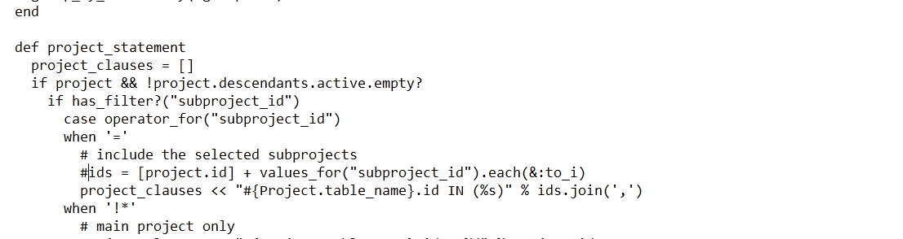
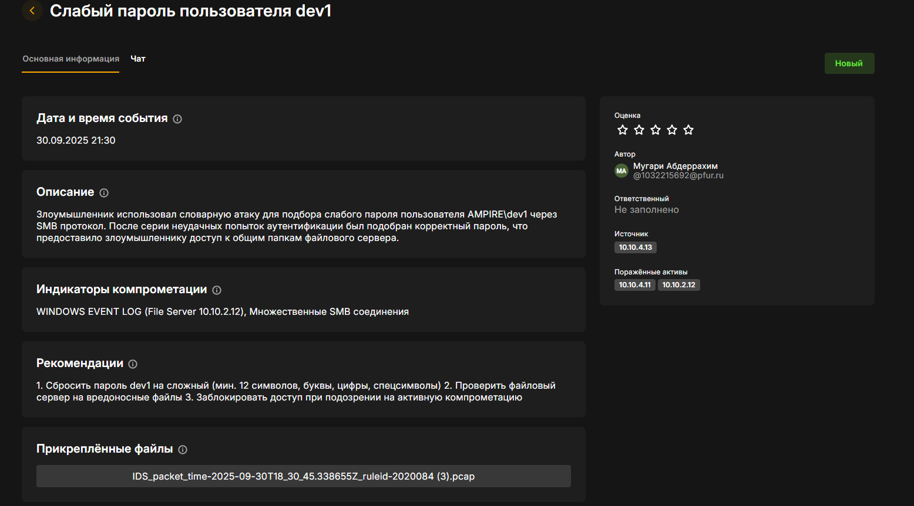

---
## Front matter
lang: ru-RU
title: Защита научно-технической информации предприятия
author:
  - Мугари Абдеррахим
  - Королёв Иван 
  - Кудряшов Артём
  - Ощепков Дмитрий
  - Оганнисян Давит
  - Шуплецов Александр
  
institute:
  - Российский университет дружбы народов, Москва, Россия
  - Факультет физико-математических и естественных наук
date: 30 сентября 2025 

## i18n babel
babel-lang: russian
babel-otherlangs: english

## Formatting pdf
toc: false
toc-title: Содержание
slide_level: 2
aspectratio: 169
section-titles: true
theme: metropolis
header-includes:
 - \metroset{progressbar=frametitle,sectionpage=progressbar,numbering=fraction}
---

# Введение

## Цель работы

Исследовать и задокументировать инцидент информационной безопасности в корпоративной инфраструктуре компании AMPIRE, выявить уязвимости и предложить меры по их устранению.

## Описание инфраструктуры

Инфраструктура компании AMPIRE включает:

- Developer Workstation (10.10.4.13) - рабочее место разработчика dev1

- Manager Workstation (10.10.4.11) - рабочее место менеджера

- File Server (10.10.2.12) - файловый сервер

- Redmine Server (10.10.2.15) - сервер управления проектами

- Internal Router (10.10.2.254) - внутренний маршрутизатор

## Описание инфраструктуры

Представлена схема сети компании.

{#fig:001 width=80%}

# Ход расследования

## Этап 1: Начальная компрометация

### Обнаружение подозрительной активности

При анализе событий ViPNet IDS были обнаружены подозрительные попытки подключения с узла 10.10.4.13 (Developer Workstation) к узлу 10.10.4.11 (Manager Workstation) .

{#fig:002 width=90%}

## Анализ логов аутентификации

Проверка журналов ViPNet IDS NS показала множественные попытки входа :

{#fig:003 width=90%}

## Анализ логов аутентификации

**Обнаружено:**
- Множественные неудачные попытки входа
- Успешный вход после серии неудачных попыток
- Источник: 10.10.4.13 (Developer Workstation)
- Цель: 10.10.4.11 (Manager Workstation)

# Этап 2: Lateral Movement и установка backdoor

## Загрузка вредоносных файлов

После успешной компрометации Manager Workstation, с неё были загружены файлы на File Server :

{#fig:004 width=150%}

## Загрузка вредоносных файлов
### Загруженные файлы:
- bcdoor.exe (backdoor)
- legacy.exe (LaZagne - инструмент для кражи паролей)
- Вредоносный .bat файл

## Создание персистентности

На Developer Workstation была обнаружена задача в планировщике :

{#fig:005 width=100%}

## Создание персистентности

### Параметры задачи:
- Название: "Evil task"
- Запуск: каждые 5 минут


## Кража учетных данных

Запуск LaZagne для извлечения сохраненных паролей :

{#fig:006 width=70%}

## Кража учетных данных

### Извлеченные данные:
```
URL: http://redmine.ampire.corp/
Username: dev1
Password: qwe123!@#
```

# Этап 3: Атака XSS на Redmine (CVE-2019-17427)

## Внедрение вредоносного кода

С Manager Workstation была проведена XSS атака на Redmine. показана wiki страница с внедренным payload:

{#fig:007 width=100%}

## Внедрение вредоносного кода

Исходный код страницы с вредоносным JavaScript представлен на:

{#fig:009 width=100%}

## XSS Payload:

```html
<pre onfocusin="let xhr=new XMLHttpRequest;
xhr.onreadystatechange=function(){
  if(4===xhr.readyState){
    // Извлечение CSRF токена
    // Создание admin пользователя "hacker"
    // Включение REST API
  }
},
xhr.open('GET','http://redmine.ampire.corp/settings?tab=api'),
xhr.send();" tabindex=1>
```

## Результат XSS атаки

После срабатывания XSS при посещении страницы администратором были получены следующие результаты:

{#fig:010 width=100%}

## Результат XSS атаки

{#fig:011 width=70%}

**Созданный пользователь:**
- Login: hacker
- Email: hacker@hacker.ru
- Права: Administrator
- REST API: Enabled

# Этап 4: SQL Injection (CVE-2019-18890)

## Эксплуатация Blind SQL Injection

Используя REST API, была проведена Blind SQL инъекция. HTTP запрос с инъекцией показан :

{#fig:012 width=70%}

## Эксплуатация Blind SQL Injection

**Техника атаки:**
```
GET /issues.xml?project_id=1&subproject_id=1;SELECT+SLEEP(2)

Посимвольное извлечение данных:
- Если символ верный → задержка 2 секунды
- Если символ неверный → быстрый ответ
```

# Анализ с помощью средств мониторинга

## ViPNet IDS NS

### Обнаруженные события

Общий список событий в ViPNet IDS представлен на:

{#fig:013 width=70%}

## ViPNet IDS NS

**Критические события:**
- ET ATTACK_RESPONSE LaZagne Artifact Outbound
- AM EXPLOIT Possible Redmine < v4.0.4 XSS (CVE-2019-17427)
- ET WEB_SERVER SQL Injection Select Sleep Time Delay


# Устранение уязвимостей

## Уязвимость 1: Слабый пароль

### Изменение пароля в Active Directory

Процесс сброса пароля пользователя в Active Directory показан на :

{#fig:014 width=70%}


## Уязвимость 2: XSS (CVE-2019-17427)

### Исправление в коде Redmine

Файл redcloth3.rb до исправления показан на:

{#fig:015 width=70%}

## Уязвимость 2: XSS (CVE-2019-17427)

Процесс внесения изменений в redcloth3.rb представлен на :

{#fig:016 width=70%}

## Уязвимость 2: XSS (CVE-2019-17427)

### Код исправления:
```ruby
ALLOWED_TAGS = %w(redpre pre code kbd notextile)
def escape_html_tags(text)
  text.gsub!(%r{<(\/?([!\w]+)[^<>\n]*)(>?)}) do |m|
    if ALLOWED_TAGS.include?($2) && $3.present?
      "<#{$1}#{$3}"
    else
      "&lt;#{$1}#{'&gt;' unless $3.blank?}"
    end
  end
end
```
## Уязвимость 2: XSS (CVE-2019-17427)

### Перезапуск сервера
- После внесения изменений необходимо было перезапустить службу веб сервера:

{#fig:017 width=70%}

## Уязвимость 3: SQL Injection (CVE-2019-18890)

### Исправление в query.rb

Файл query.rb с уязвимым кодом представлен на :

{#fig:018 width=100%}

## Уязвимость 3: SQL Injection (CVE-2019-18890)

Исправленный код показан на:

{#fig:019 width=100%}

## Уязвимость 3: SQL Injection (CVE-2019-18890)

```ruby

sudo nano /var/www/redmine/app/models/query.rb
```
- Нашли строку:
```ruby
   ids = [project.id] + values_for(column.name).map(&:to_i)
```
- Закомментировали ее:
```ruby

   # ids = [project.id] + values_for(column.name).map(&:to_i)
```

# Удаление последствий

## Удаление backdoor

Процесс удаления задачи из планировщика показан на:

{#fig:020 width=70%}

## Удаление загруженных файлов

```cmd
schtasks /delete /tn "Evil task" /F
del C:\Users\dev1\Downloads\svchosting.exe /F
del C:\Users\dev1\Downloads\legacy.exe /F
```

## Удаление пользователя hacker

Удаление пользователя hacker из Redmine показано на 

{#fig:021 width=70%}

## Отключение REST API

Процесс отключения REST API в настройках представлен на :

{#fig:022 width=100%}


# Классификация инцидентов

## Общая информация о выявленных инцидентах

В результате расследования были выявлены и задокументированы три уязвимости и два последствия их эксплуатац.

## Уязвимость 1: Слабый пароль пользователя dev1 

{#fig:023 width=50%}

## Последствие 1: Установка backdoor и кража credentials через LaZagne

{#fig:024 width=50%}


## Уязвимость 2: XSS (CVE-2019-17427)

### Описание

Используя украденные credentials `ampire\dev1`, инсайдер провел XSS атаку для получения административных прав в Redmine. Уязвимость в обработке wiki-разметки Redmine позволяет внедрить вредоносный JavaScript код, который выполняется при посещении страницы администратором.

## Уязвимость 2: XSS (CVE-2019-17427)


{#fig:025 width=50%}

## Последствие 2: Создание admin (hacker) аккаунта для доступа к конфиденциальным проектам

### Описание

Инсайдер создал admin аккаунт для полного доступа к базе проектов:
- **Login:** hacker
- **Admin:** YES
- **REST API:** Enabled

Этот аккаунт предоставляет полный доступ ко всем проектам Redmine, включая конфиденциальные проекты разработки насосных станций.

## Последствие 2: Создание admin (hacker) аккаунта для доступа к конфиденциальным проектам

{#fig:026 width=50%}


## Уязвимость 3: Blind SQL Injection (CVE-2019-18890)

### Описание

CVE-2019-18890: SQL injection в параметре `subproject_id` в Redmine < 3.3.10 позволяет выполнять произвольные SQL запросы, обходя систему прав доступа. 

{#fig:027 width=50%}


# Рекомендации

## Немедленные меры

1. **Изоляция скомпрометированных узлов:**
   - 10.10.4.13 (Developer Workstation)
   - 10.10.4.11 (Manager Workstation)
   - 10.10.2.254 (Internal Router - требует проверки)

2. **Сброс всех паролей:**
   - Учетные записи Active Directory
   - Пароли приложений (Redmine, email, VPN)
   - Сервисные учетные записи

3. **Форензика:**
   - Создание образов дисков
   - Сбор логов для расследования
   - Анализ сетевого трафика

## Долгосрочные меры

### Организационные меры

1. **Усиление процедур найма:**
   - Тщательная проверка кандидатов
   - Background check
   - Проверка рекомендаций

2. **Security Awareness Training:**
   - Обучение персонала
   - Регулярные тренинги
   - Симуляции атак

3. **Incident Response Plan:**
   - Документированные процедуры
   - Назначенные роли
   - Регулярные учения

# Заключение

В ходе лабораторной работы был успешно расследован инцидент информационной безопасности в инфраструктуре AMPIRE . 

{width=50%}


Атака представляла собой сложную многоэтапную операцию, включающую:

1. **Insider threat** - инсайдер dev1 с рабочей станции 10.10.4.13
2. **Lateral movement** - компрометация Manager Workstation для использования как pivot point
3. **Dead drop механизм** - использование File Server для обмена данными

Все выявленные уязвимости были успешно устранены, вредоносное ПО удалено, несанкционированные учетные записи заблокированы. Предложенные рекомендации позволят предотвратить подобные инциденты в будущем.

## Выводы

1. Критически важно внедрение многоуровневой защиты.
2. Необходим постоянный мониторинг insider threats
3. Своевременное обновление ПО предотвращает эксплуатацию известных уязвимостей
4. Корреляция событий из разных источников позволяет выявлять сложные атаки
5. Human factor остается слабым звеном в системе безопасности

# Список использованных инструментов

- ViPNet IDS NS - обнаружение вторжений
- ViPNet TIAS - корреляция событий
- Security Onion (Kibana, Squert) - анализ сетевого трафика
- Wireshark - анализ пакетов
- Active Directory - управление учетными записями
- Планировщик задач Windows - поиск персистентности
