---
## Front matter
title: "Лабораторная работа № 2"
subtitle: "Исследование протокола TCP и алгоритма управления очередью RED"
author: "Мугари Абдеррахим"

## Generic otions
lang: ru-RU
toc-title: "Содержание"

## Bibliography
bibliography: bib/cite.bib
csl: pandoc/csl/gost-r-7-0-5-2008-numeric.csl

## Pdf output format
toc: true # Table of contents
toc-depth: 2
lof: true # List of figures
lot: true # List of tables
fontsize: 12pt
linestretch: 1.5
papersize: a4
documentclass: scrreprt
## I18n polyglossia
polyglossia-lang:
  name: russian
  options:
	- spelling=modern
	- babelshorthands=true
polyglossia-otherlangs:
  name: english
## I18n babel
babel-lang: russian
babel-otherlangs: english
## Fonts
mainfont: IBM Plex Serif
romanfont: IBM Plex Serif
sansfont: IBM Plex Sans
monofont: IBM Plex Mono
mathfont: STIX Two Math
mainfontoptions: Ligatures=Common,Ligatures=TeX,Scale=0.94
romanfontoptions: Ligatures=Common,Ligatures=TeX,Scale=0.94
sansfontoptions: Ligatures=Common,Ligatures=TeX,Scale=MatchLowercase,Scale=0.94
monofontoptions: Scale=MatchLowercase,Scale=0.94,FakeStretch=0.9
mathfontoptions:
## Biblatex
biblatex: true
biblio-style: "gost-numeric"
biblatexoptions:
  - parentracker=true
  - backend=biber
  - hyperref=auto
  - language=auto
  - autolang=other*
  - citestyle=gost-numeric
## Pandoc-crossref LaTeX customization
figureTitle: "Рис."
tableTitle: "Таблица"
listingTitle: "Листинг"
lofTitle: "Список иллюстраций"

lotTitle: "Список таблиц"
lolTitle: "Листинги"
## Misc options
indent: true
header-includes:
  - \usepackage{indentfirst}
  - \usepackage{float} # keep figures where there are in the text
  - \floatplacement{figure}{H} # keep figures where there are in the text
---

# Цель работы

- Цель лабораторной работы — исследование поведения различных версий протокола TCP (NewReno, Reno, Veags) в сети с управлением перегрузками с использованием алгоритма RED. Анализируется изменение размера окна перегрузки и влияние параметров очереди на эффективность передачи данных. Результаты визуализируются с помощью xgraph, с  настройкой цвета и подписей графиков.

# Выполнение лабораторной работы

## Пример с дисциплиной RED

### Алгоритм управления очередью RED:

- здесь мы познакомились с алгоритмом RED (случайного раннего обнаружения) и его функцией сброса (Схема и распределение) (рис. [-@fig:001]).

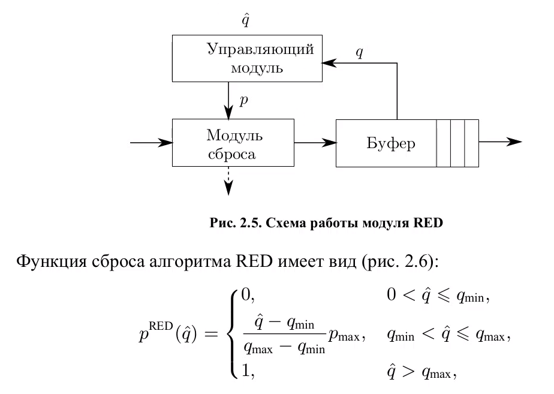{#fig:001 width=70%}


### Реализация модели задачи

### Создание симудятора

- Создается объект симулятора (ns).
- Определяются узлы сети: s1, s2, s3, s4 (отправители) и r1, r2 (маршрутизаторы) (рис. [-@fig:002]).

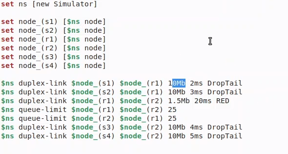{#fig:002 width=70%}

### Создание соединений между узлами 

- Создаются дуплексные (двусторонние) соединения между узлами с заданной пропускной способностью, задержкой и алгоритмом управления очередью (DropTail или RED).
- Задается лимит очереди на связи r1-r2 и r2-r1 (по 25 пакетов). (рис. [-@fig:003]).

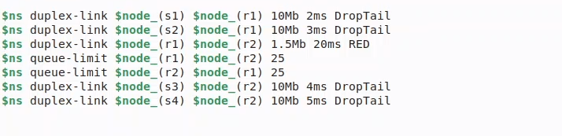{#fig:003 width=70%}

### Настройка TCP-соединений

- Создаются два TCP-соединения: одно использует TCP/NewReno, другое — TCP/Reno.
- Каждое соединение имеет размер окна 15.
- На TCP-соединения привязываются источники трафика (FTP) (рис. [-@fig:004]).

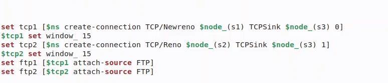{#fig:004 width=70%}

### Настройка мониторинга очередей и логирования

- Открывается файл WindowVsTimeReno для записи данных о размере окна перегрузки.
- Включается мониторинг очереди между r1 и r2 (файл qm.out).
- Настраивается трассировка состояния очереди RED (рис. [-@fig:005]).

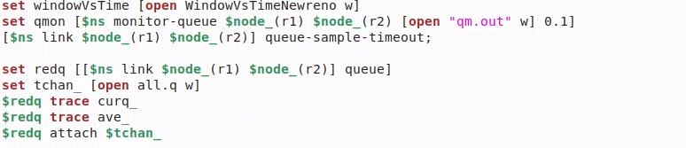{#fig:005 width=70%}

### Запуск передачи данных

**FTP1 (TCP NewReno)** начинает передачу в **0.0 сек**.
Через **1.1 сек**. начинается запись данных о размере окна перегрузки.
**FTP2 (TCP Reno)** стартует через **3.0 сек**.
Симуляция заканчивается в **10 сек**.(рис. [-@fig:006]).

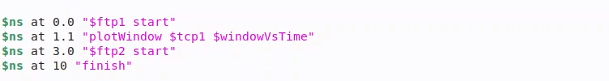{#fig:006 width=70%}


### Функция для записи изменения размера окна TCP

Функция записывает размер окна TCP в файл каждые 0.01 сек (рис. [-@fig:007]).

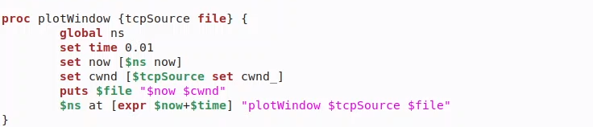{#fig:007 width=70%}

### Функция завершения симуляции и построения графиков

- Код обрабатывает данные о длине очереди и создает временные файлы.
- Генерирует два графика с помощью xgraph TCPNewrenoCWND и queue (рис. [-@fig:008]).

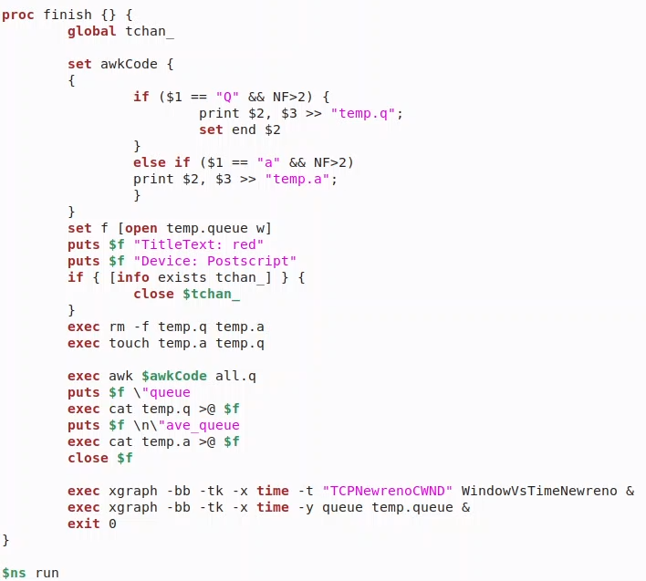{#fig:008 width=70%}

### Запуск симуляции

::: center
```tcl
    $ns run
```
:::


### Визуализация: 

- Построение графиков с помощью xgraph после завершения симуляции. (рис. [-@fig:009]).

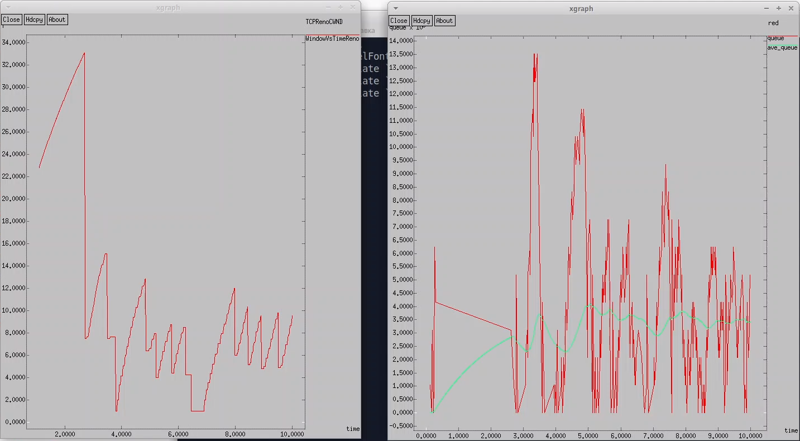{#fig:009 width=70%}


### Сравнение результатов и пояснения

#### TCP Reno

- **Механизм работы:** Основан на классическом алгоритме управления перегрузкой с фазами **slow start, congestion avoidance и механизмами fast retransmit/fast recovery**.
- **Характеристика поведения:** При потере пакетов окно резко уменьшается, что может приводить к значительным колебаниям в размере окна (**cwnd**) 
- **Особенности:** Может испытывать проблемы при возникновении множественных потерь в одном цикле, что приводит к задержкам в восстановлении (рис. [-@fig:010]).

{#fig:010 width=70%}


#### TCP NewReno

Здесь мы просто изменили тип TCP-агента на NewReno (рис. [-@fig:011]).

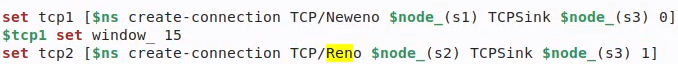{#fig:011 width=70%}


- **Механизм работы:** Улучшенная версия Reno, где алгоритм **fast recovery** остаётся активным до восстановления всех потерянных пакетов в текущем цикле.
- **Характеристика поведения:** Более устойчив к множественным потерям в одном цикле. В графиках cwnd можно наблюдать менее резкие падения по сравнению с **Reno**.
- **Особенности:** В условиях высокой вероятности потерь (например, в сочетании с **RED-очередью**) может обеспечить более стабильный пропускной потенциал за счёт быстрейшего восстановления (рис. [-@fig:012]).

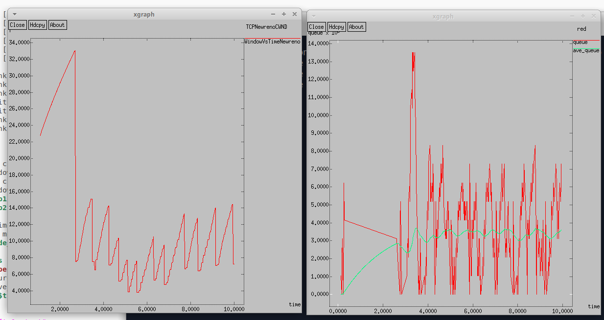{#fig:012 width=70%}


#### TCP Vegas

Пототм изменили тип TCP-агента на Vegas (рис. [-@fig:013]).

- TCP Vegas часто приводит к более стабильной и «аккуратной» загрузке сети, снижая переполнение очереди и потери. Однако в смешанных сетях (где есть Reno/NewReno и Vegas одновременно) Vegas может проигрывать по пропускной способности более «агрессивным» вариантам, так как раньше снижает скорость при признаках роста задержек.

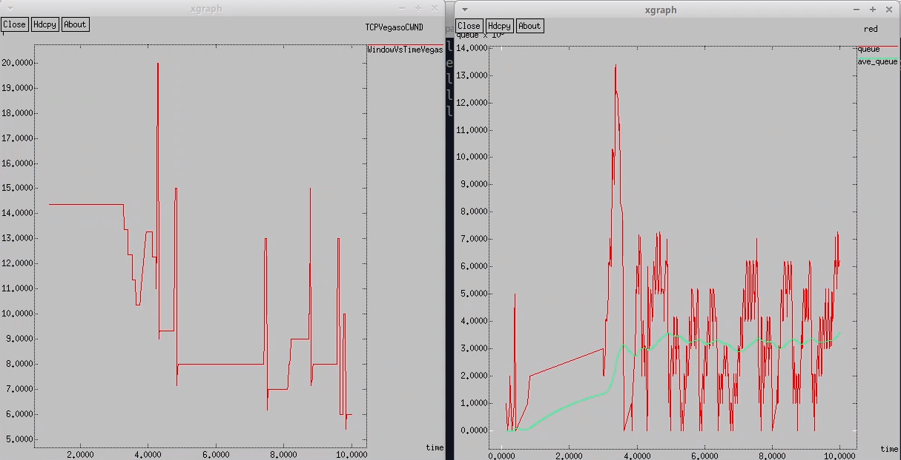{#fig:013 width=70%}

#### Вывод 

- **Reno**: наглядные колебания очереди и cwnd, резкие падения окна при потерях.
- **NewReno**: в целом схож с Reno, но лучше восстанавливается после множественных потерь, что делает его чуть более стабильным и эффективным.
- **Vegas**: стремится минимизировать потери и задержки, регулируя окно заранее на основе измерений **RTT**, поэтому обычно показывает более низкую и стабильную очередь и менее резкие скачки cwnd, но при этом может иметь более низкую пропускную способность в конкурентной среде.

- С точки зрения графиков, у Reno/NewReno красная линия (длина очереди) часто уходит довольно высоко, а затем падает, сопровождаясь резким снижением cwnd. У Vegas кривая очереди более сглажена, а **cwnd** меняется плавнее.


### Внести изменения при отображении окон с графиками

- **Цвета траекторий:** (рис. [-@fig:014]).

- `"0.Color: orange" — первая линия (размер очереди).`
- `"1.Color: cyan" — вторая линия (средняя длина очереди).`

- **Фон и цвет графиков:**

- `Фон (-bg black) — чёрный.`
- `Цвет линий (-fg gold) — золотой (но это влияет только на оси, заголовок и подписи).`

- **Заголовки:**
- `"Queue_Stats" — добавлен заголовок для второго графика.`
- `"TCPNewrenoCWND" — название графика для размера окна TCP.`
    
- **подписи к осям, подпись траектории в легенде**

- `puts $f \n\"lenghtofochered"`
- `-x time -y queue`
    
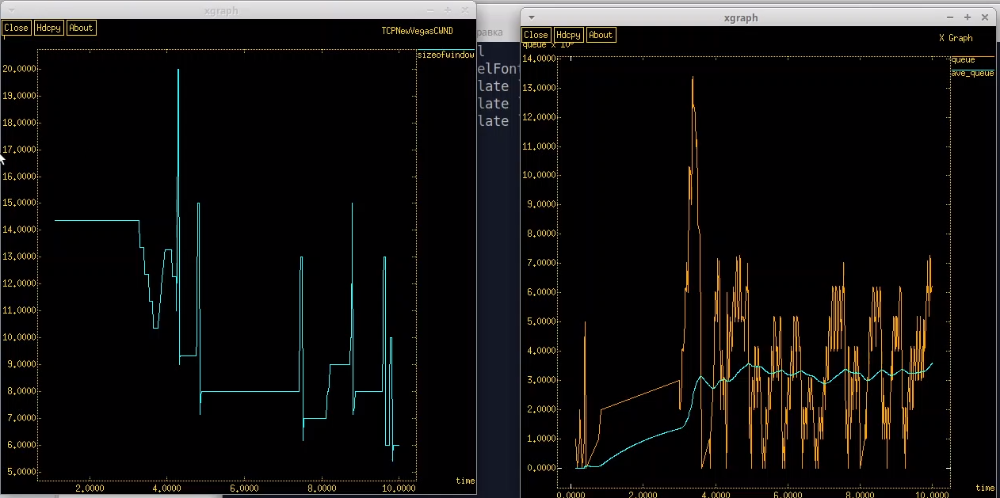{#fig:014 width=70%}

# Выводы

- В ходе работы изучены механизмы управления окном перегрузки в TCP NewReno, Reno, Veags и динамика очереди. Графики показали зависимость этих параметров от времени, а изменения оформления улучшили их интерпретацию. Анализ подтвердил, что управление окном и очередью повышает эффективность сети.

Более подробно про RED см. в [@kurose_book_computernetworking_en; @tanenbaum_book_computernetworks_en;]

    
# Список литературы{.unnumbered}

::: {#refs}
:::
