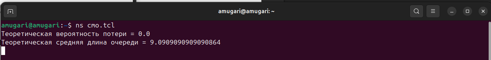
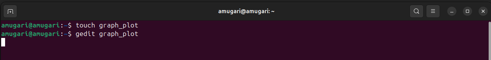

---
## Front matter
lang: ru-RU
title: Лабораторная работа № 3
subtitle: Моделирование стохастических процессов
author:
  - Мугари Абдеррахим
institute:
  - Российский университет дружбы народов, Москва, Россия
date: 22 февраля 2025

## i18n babel
babel-lang: russian
babel-otherlangs: english

## Formatting pdf
toc: false
toc-title: Содержание
slide_level: 2
aspectratio: 169
section-titles: true
theme: metropolis
header-includes:
 - \metroset{progressbar=frametitle,sectionpage=progressbar,numbering=fraction}
---

# Информация

## Преподаватель 

:::::::::::::: {.columns align=center}
::: {.column width="70%"}

  * Анна Владиславовна Королькова
  * доцент кафедры прикладной информатики и теории вероятностей РУДН; 
  * заведующий лабораторией кафедры прикладной информатики и теории вероятностей РУДН (по совместительству);  
  *  программист I кат.   
  * Российский университет дружбы народов
  * [korolkova-av@rudn.ru](mailto:korolkova-av@rudn.ru)

:::
::: {.column width="30%"}


:::
::::::::::::::

## Докладчик

:::::::::::::: {.columns align=center}
::: {.column width="70%"}

  * Мугари Абдеррахим
  * Студент третьего курса 
  * фундаментальная информатика и информационные технологии
  * Российский университет дружбы народов
  * [1032215692@rudn.ru](mailto:1032215692@rudn.ru)
  * <https://iragoum.github.io/>

:::
::: {.column width="30%"}


:::
::::::::::::::


# Цель работы

- Цель данной лабораторной работы — изучение моделирования стохастических процессов в системах массового обслуживания (СМО) с использованием математических моделей и компьютерного моделирования в NS-2.


# Предварительные сведения.

## Основные понятия

Система массового обслуживания (**СМО**) – это математическая модель, описывающая процесс поступления заявок, их обработку и возможные задержки. В данной работе рассматриваются два типа СМО:

- **M|M|1** – одноканальная СМО с неограниченной очередью.  
- **M|M|n|R** – многоканальная СМО с конечной емкостью буфера.  

Для обеих систем входной поток заявок распределен по **пуассоновскому закону** с интенсивностью \( $\lambda$\),  
а время обслуживания заявок распределено по **экспоненциальному закону** с параметром \( $\mu$\).  

---

## Математическая модель

Для описания работы системы используются **уравнения Колмогорова**, которые описывают вероятности нахождения определенного количества заявок в системе в каждый момент времени.  

### Для **M|M|1**:

- **Стационарное распределение вероятностей** выражается формулой:  
  $$
  p_i = (1 - \rho) \rho^i, \quad \text{где} \quad \rho = \frac{\lambda}{\mu}
  $$
  Здесь \( $\rho$ \) – коэффициент загрузки системы.  
  
## Математическая модель

- **Среднее число заявок в системе**:  
  $$
  N = \frac{\rho}{1 - \rho}
  $$

- **Среднее время пребывания заявки в системе**:  
  $$
  v = \frac{1}{\mu(1 - \rho)}
  $$

# Выполнение лабораторной работы

## Реализация модели на NS-2

- Для моделирования мы используем симулятор NS-2. В коде на Tcl задаются параметры системы:

    - Интенсивность поступления заявок (\( $\lambda = 30.0$\))
    - Средняя скорость обслуживания (\( $\mu = 33.0$\))
    - Размер очереди (100000 для неограниченной системы)

- В коде создаются два узла, соединенные каналом с пропускной способностью 100 Кб/с, и задается очередь DropTail. Для генерации трафика используется агент UDP, который передает пакеты случайного размера.

## Реализация модели на NS-2

- Кроме того, реализована функция для мониторинга очереди и вычисления:

    - Теоретической вероятности потери пакетов
    - Средней длины очереди

```tcl
# Создание объекта симулятора
set ns [new Simulator]

# Открытие файла трассировки
set tf [open out.tr w]
$ns trace-all $tf

# Определение параметров системы
set lambda 30.0

```

## Реализация модели на NS-2

```tcl
set mu 33.0
set qsize 100000
set duration 1000.0

# Создание узлов и соединения между ними
set n1 [$ns node]
set n2 [$ns node]

```
## Реализация модели на NS-2

```tcl
set link [$ns simplex-link $n1 $n2 100kb 0ms DropTail]
$ns queue-limit $n1 $n2 $qsize

# Настройка случайных переменных
set InterArrivalTime [new RandomVariable/Exponential]
$InterArrivalTime set avg_ [expr 1/$lambda]

set pktSize [new RandomVariable/Exponential]
$pktSize set avg_ [expr 100000.0/(8*$mu)]
```
## Реализация модели на NS-2

```tcl 

# Создание агентов (источник и приемник)
set src [new Agent/UDP]
$src set packetSize_ 100000
$ns attach-agent $n1 $src

set sink [new Agent/Null]
$ns attach-agent $n2 $sink

$ns connect $src $sink

```

## Реализация модели на NS-2

```tcl

# Мониторинг очереди
set qmon [$ns monitor-queue $n1 $n2 [open qm.out w] 0.1]
$link queue-sample-timeout

# Функция завершения симуляции
proc finish {} {
    global ns tf
    $ns flush-trace
    close $tf
    exit 0
}

```

## Реализация модели на NS-2

```tcl

# Функция генерации пакетов
proc sendpacket {} {
    global ns src InterArrivalTime pktSize
    set time [$ns now]
    $ns at [expr $time + [$InterArrivalTime value]] "sendpacket"
    set bytes [expr round([$pktSize value])]
    $src send $bytes
}

```
## Реализация модели на NS-2

```tcl 

# Запуск генерации пакетов и завершения симуляции
$ns at 0.0001 "sendpacket"
$ns at $duration "finish"

# Вычисление характеристик системы
set rho [expr $lambda/$mu]

```
## Реализация модели на NS-2

```tcl

set ploss [expr (1-$rho)*pow($rho,$qsize)/(1-pow($rho,($qsize+1)))]
puts "Теоретическая вероятность потери = $ploss"

set aveq [expr $rho*$rho/(1-$rho)]
puts "Теоретическая средняя длина очереди = $aveq"

# Запуск симуляции
$ns run

```

## Анализ результатов

- После выполнения кода мы получили

    - Теоретическая вероятность потери = 0.0
    - Средняя длина очереди = 9.09


{#fig:001 width=80%}


- Очередь никогда не переполняется.
- В среднем в системе ≈ 9 заявок ожидают обработки.
- Система стабильна, но работает с высокой нагрузкой.


## Построение графика в Gnuplot

### Создание файла graph_plot 

- мы создали отдельный файл в каталоге проекта с именем **graph_plot**

{#fig:002 width=100%}

## Построение графика в Gnuplot

- Открыли его для редактирования и добавили следующий код

```tcl

#!/usr/bin/gnuplot -persist
# Устанавливаем кодировку и параметры вывода
set encoding utf8
set term pdfcairo font "Arial,9"
# Определяем выходной файл
set out 'qm.pdf'
# Название графика
set title "График средней длины очереди"
```
## Построение графика в Gnuplot

```tcl

# Настройки линий
set style line 2
# Подписи осей
set xlabel "t"
set ylabel "Пакеты"
# Построение графика на основе данных из qm.out
plot "qm.out" using ($1):($5) with lines title "Размер очереди (в пакетах)", \
     "qm.out" using ($1):($5) smooth csplines title "Приближение сплайном", \
     "qm.out" using ($1):($5) smooth bezier title "Приближение Безье"
```

## Построение графика в Gnuplot 

- Потом запустили его.
- После выполнения появится график qm.pdf, где можно увидеть, как изменяется длина очереди во времени

{#fig:003 width=50%}


# Выводы

## Выводы

- В данной работе изучены основы моделирования стохастических процессов в системах массового обслуживания с акцентом на модели M|M|1 и M|M|n|R, а также исследованы уравнения Колмогорова для описания поведения заявок. Реализация моделирования в NS-2 и а результаты, визуализированные через Gnuplot

