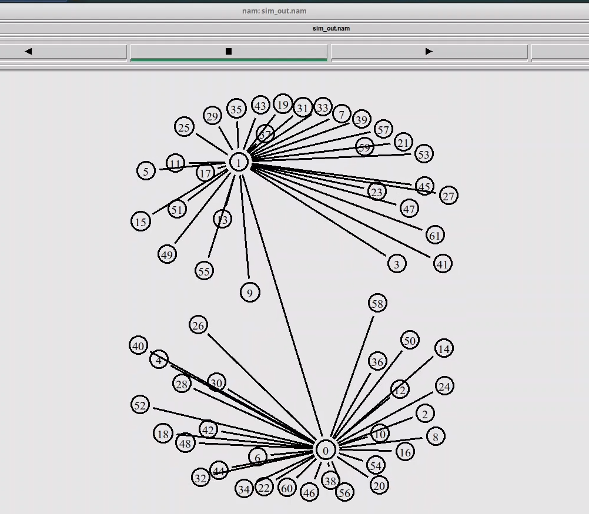
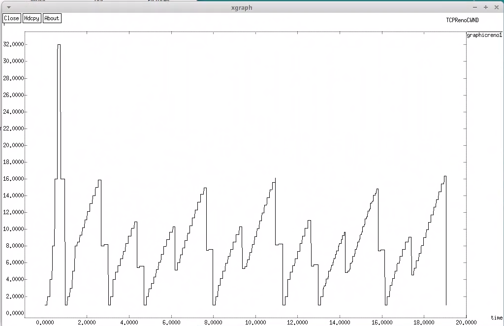
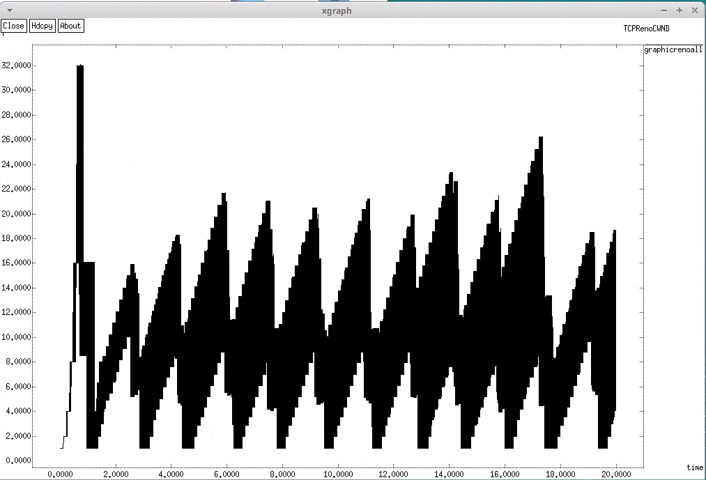
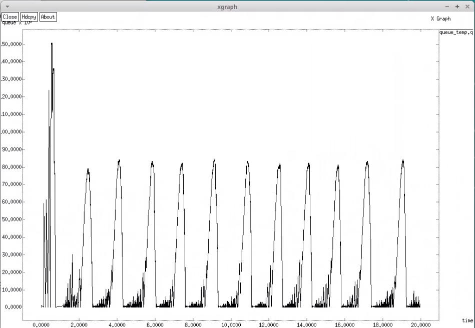
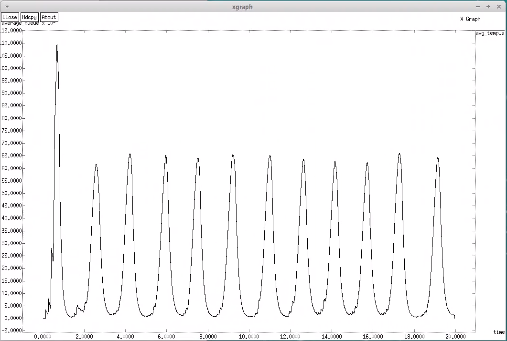
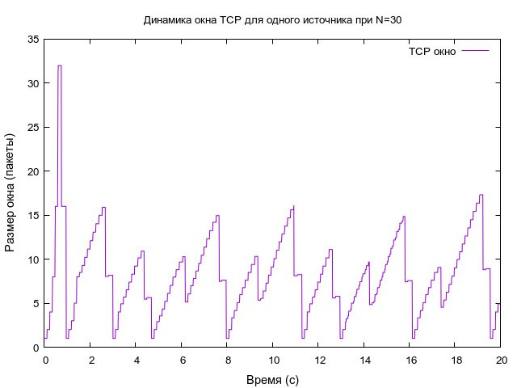
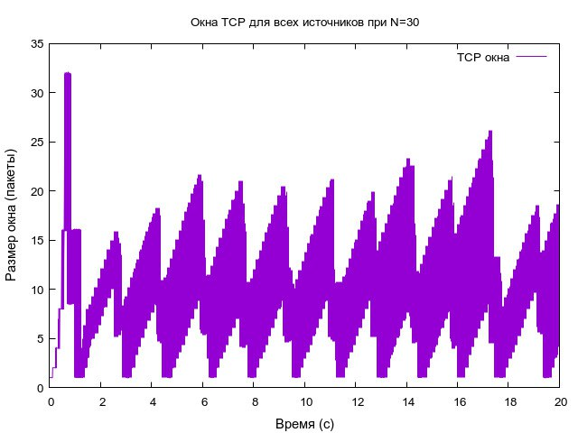
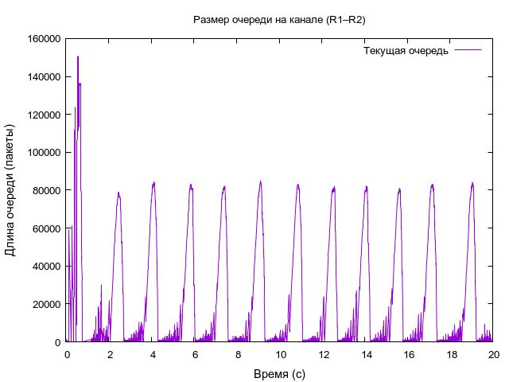
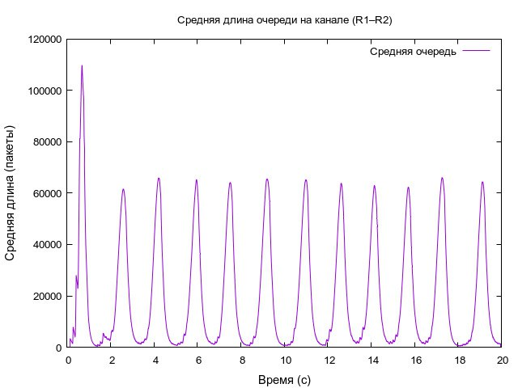

---
## Front matter
title: "Лабораторная работа № 4"
subtitle: "Задание для самостоятельного выполнения"
author: "Мугари Абдеррахим"

## Generic options
lang: ru-RU
toc-title: "Содержание"

## Bibliography
bibliography: bib/cite.bib
csl: pandoc/csl/gost-r-7-0-5-2008-numeric.csl

## Pdf output format
toc: true # Table of contents
toc-depth: 2
lof: true # List of figures
lot: true # List of tables
fontsize: 13pt
linestretch: 1.5
papersize: a4
documentclass: scrreprt
## I18n polyglossia
polyglossia-lang:
  name: russian
  options:
    - spelling=modern
    - babelshorthands=true
polyglossia-otherlangs:
  name: english
## I18n babel
babel-lang: russian
babel-otherlangs: english
## Fonts
mainfont: Times New Roman
romanfont: Times New Roman
sansfont: Times New Roman
monofont: "Courier New"
mathfont: STIX Two Math
mainfontoptions: Scale=1.0
romanfontoptions: Scale=1.0
sansfontoptions: Scale=1.0
monofontoptions: Scale=1.0,FakeStretch=0.9
mathfontoptions:
## Biblatex
biblatex: true
biblio-style: "gost-numeric"
biblatexoptions:
  - parentracker=true
  - backend=biber
  - hyperref=auto
  - language=auto
  - autolang=other*
  - citestyle=gost-numeric
## Pandoc-crossref LaTeX customization
figureTitle: "Рис."
tableTitle: "Таблица"
listingTitle: "Листинг"
lofTitle: "Список иллюстраций"
lotTitle: "Список таблиц"
lolTitle: "Листинги"
## Misc options
indent: true
header-includes:
  - \usepackage{listings}
  - \renewcommand{\lstlistingname}{Листинг}
  - \usepackage{indentfirst}
  - \usepackage{float} # keep figures where there are in the text
  - \floatplacement{figure}{H} # keep figures where there are in the text
  - \renewcommand{\familydefault}{\rmdefault} # Ensure Times New Roman for main text
  - \lstset{basicstyle=\ttfamily\fontsize{10pt}{10pt}\selectfont,lineskip=-1pt} 

---

# Цель работы

- Цель данной лабораторной работы это выполнение задания для самостоятельного выполнения, основанного на знаниях, полученных в предыдущих трёх лабораторных занятиях, с использованием инструмента NS-2 для изучения и анализа поведения сети в условиях высокой нагрузки. Работа направлена на:

    - Исследование динамики окна TCP.
    - Оценка поведения очередей на канале R1-R2.
    - Анализ производительности сети.
    - Визуализация топологии сети.


# Описание выполнения всех лабораторных работ из раздела

## Лабораторная работа 1. Простые модели компьютерной сети

### Цель работы

- Цель лабораторной работы — освоение базовых навыков моделирования компьютерных сетей с помощью NS-2, изучение создания простых топологий сети, настройки агентов и приложений для передачи данных, а также анализ результатов с использованием визуализатора NAM. Работа учит моделированию сетей с различными топологиями (линейная, усложнённая, кольцевая) и дисциплинами обслуживания очередей (DropTail).

### Вывод по Лабораторной работе 1

- В результате выполнения лабораторной работы освоены базовые навыки работы с NS-2: создание шаблона сценария, настройка топологий (линейная, звездообразная, кольцевая), использование агентов (TCP, UDP), приложений (FTP, CBR), дисциплин очередей (DropTail) и визуализация результатов в NAM. Установлено, что:

    - Линейная топология демонстрирует простую передачу данных с минимальной перегрузкой.
    - Усложнённая топология с узким местом  вызывает потерю пакетов из-за перегрузки в очереди.
    - Кольцевая топология с динамической маршрутизацией позволяет перераспределять трафик при разрыве соединений, что повышает надёжность сети.
   
## Лабораторная работа 2. Исследование протокола TCP и алгоритма управления очередью RED

### Цель работы

- Цель работы — углублённое изучение протокола TCP (в частности, TCP Reno) и алгоритма RED для управления очередями, моделирование их взаимодействия в сети с NS-2, анализ динамики окна TCP и поведения очередей, а также сравнение различных вариантов TCP (Reno, NewReno, Vegas).

### Вывод по Лабораторной работе 2

- Работа позволила изучить работу TCP Reno, его механизмы управления перегрузкой, а также алгоритм RED для управления очередями. Установлено, что:

    - TCP Reno эффективно адаптируется к потерям, но может вызывать синхронизированные перегрузки при многопоточной передаче.
    - RED предотвращает переполнение буфера, отбрасывая пакеты с вероятностью, зависящей от средней длины очереди, но не устраняет временные пики.
    - Сравнение с NewReno и Vegas показало, что NewReno уменьшает задержки, а Vegas снижает потери, но может ограничивать производительность.
    
    
## Лабораторная работа 3. Моделирование стохастических процессов

### Цель работы

- Цель работы — изучение стохастических моделей обслуживания (СМО), таких как M|M|1 и M|M|n|R, с использованием NS-2 для моделирования систем массового обслуживания с бесконечной и конечной ёмкостью очереди, а также анализ характеристик системы (вероятность потерь, средняя длина очереди) и построение графиков.

### Вывод по Лабораторной работе 3

- Работа позволила изучить стохастические модели обслуживания (M|M|1) с помощью NS-2, моделирование случайного поступления пакетов и анализа их влияния на очередь. Установлено, что:

    - Теоретические характеристики (вероятность потерь, средняя длина очереди) соответствуют модели M|M|1 (загрузка системы).
    - График демонстрирует случайные колебания длины очереди, что подтверждает экспоненциальное распределение интервалов поступления и обслуживания.
    

# Выполнение текущей работы :

## Описание моделируемой сети

- Сеть состоит из **N TCP-источников**, **N TCP-приёмников**, **двух маршрутизаторов R1 и R2** между источниками и приёмниками (**N** — не менее 20).
- Между **TCP-источниками** и первым маршрутизатором установлены **дуплексные соединения**:
    - Пропускная способность: **100 Мбит/с** 
    - Задержка: **20 мс** 
    - Очередь: **DropTail** 
- Между **TCP-приёмниками** и вторым маршрутизатором установлены **дуплексные соединения**:
    - Пропускная способность: **100 Мбит/с** 
    - Задержка: **20 мс** 
    - Очередь: **DropTail** 
- Между маршрутизаторами установлено **симплексное соединение (R1–R2)**:
    - Пропускная способность: **20 Мбит/с** 
    - Задержка: **15 мс** 
    - Очередь: **RED** 
    - Размер буфера: **300 пакетов** 
- В обратную сторону (**R2–R1**) — **симплексное соединение**:
    - Пропускная способность: **15 Мбит/с** 
    - Задержка: **20 мс** 
    - Очередь: **DropTail** 
- **Протокол передачи данных**: **FTP поверх TCPReno** 
- **Параметры алгоритма RED**: 
    - Минимальный порог (**q$_{min}$**): **75** 
    - Максимальный порог (**q$_{max}$**): **150** 
    - Коэффициент сглаживания (**q$_{w}$**): **0.002** 
    - Максимальная вероятность отбрасывания (**p$_{max}$**): **0.1** 
- **Максимальный размер TCP-окна**: **32** 
- **Размер передаваемого пакета**: **500 байт** 
- **Время моделирования**: **не менее 20 единиц модельного времени** 


## Выполнение

- Мы выполняли работу следующим образом, создавая и редактируя файл test.tcl и последовательно добавляя код для симуляции


- Мы вставляли код для создания симулятора и файлов трассировки:

```tcl 
# Инициализация симулятора
set sim [new Simulator]

# Создание файла для визуализации в NAM
set nam_file [open sim_out.nam w]
$sim namtrace-all $nam_file

# Создание файла для записи трассировки событий
set trace_file [open sim_trace.tr w]
$sim trace-all $trace_file

```
- Мы устанавливали параметры TCP Reno, соответствующие описанию:

```tcl 

# Настройка параметров агента TCP
Agent/TCP set window_ 32
Agent/TCP set pktSize_ 500

```
- Мы включали процедуру complete для обработки данных и завершения работы

```tcl

# Процедура завершения симуляции
proc complete {} {
    global queue_trace
    # Подготовка AWK-скрипта для обработки данных
    set awk_script {
        {
            if ($1 == "Q" && NF > 2) {
                print $2, $3 >> "queue_temp.q"
                set end_time $2
            } 
            else if ($1 == "a" && NF > 2) {
                print $2, $3 >> "avg_temp.a"
            }
        }
    }

    # Удаление старых временных файлов и создание новых
    exec rm -f queue_temp.q avg_temp.a
    exec touch queue_temp.q avg_temp.a

    set qf [open queue_temp.q w]
    puts $qf "0.Color: black"
    close $qf

    set af [open avg_temp.a w]
    puts $af "0.Color: black"
    close $af

    exec awk $awk_script full_queue.q

    # Запуск графиков и NAM
    exec xgraph -fg black -bg white -bb -tk -x time -t "TCPRenoCWND" graphicreno1 &
    exec xgraph -fg black -bg white -bb -tk -x time -t "TCPRenoCWND" graphicrenoall &
    exec xgraph -fg black -bg white -bb -tk -x time -y queue queue_temp.q &
    exec xgraph -bb -fg black -bg white -tk -x time -y average_queue avg_temp.a &
    exec nam sim_out.nam &
    exit 0
}

```
- Мы включали процедуру trackWindow для периодической записи размера окна

```tcl

# Процедура для записи данных окна TCP
proc trackWindow {tcp_obj output_file} {
    global sim
    set interval 0.01
    set current_time [$sim now]
    set window_size [$tcp_obj set cwnd_]
    puts $output_file "$current_time $window_size"
    $sim at [expr $current_time + $interval] "trackWindow $tcp_obj $output_file"
}
```

- Мы добавляли код для создания маршрутизаторов R1 и R2
```tcl

# Создание узлов маршрутизаторов
set router1 [$sim node]
set router2 [$sim node]

```
- Мы устанавливали соединения между R1 и R2 согласно описанию

```tcl

# Настройка каналов связи между маршрутизаторами
$sim simplex-link $router1 $router2 20Mb 15ms RED	
$sim simplex-link $router2 $router1 15Mb 20ms DropTail
$sim queue-limit $router1 $router2 300

```
- Мы добавляли код для создания 30 источников, 30 приёмников и их соединений с маршрутизаторами

```tcl

# Создание узлов и соединений
set node_count 30
for {set j 0} {$j < $node_count} {incr j} {
    set sender($j) [$sim node]
    set receiver($j) [$sim node]
    
    $sim duplex-link $sender($j) $router1 100Mb 20ms DropTail
    $sim duplex-link $receiver($j) $router2 100Mb 20ms DropTail
    
    # Создание TCP-соединений и привязка FTP
    set tcp_conn($j) [$sim create-connection TCP/Reno $sender($j) TCPSink $receiver($j) $j]
    set ftp_src($j) [$tcp_conn($j) attach-source FTP]
}
```

- Мы создавали и настраивали файлы для мониторинга окон TCP

```tcl

# Файлы для записи данных окна TCP
set window_one [open graphicreno1 w]
puts $window_one "0.Color: black"
set window_all [open graphicrenoall w]
puts $window_all "0.Color: black"
```

- Мы добавляли код для мониторинга очереди на канале R1-R2

```tcl

# Мониторинг очереди
set queue_monitor [$sim monitor-queue $router1 $router2 [open queue_monitor.out w] 0.1]
[$sim link $router1 $router2] queue-sample-timeout
```
- Мы устанавливали параметры RED для канала R1-R2

```tcl

# Настройка RED-очереди
set red_queue [[$sim link $router1 $router2] queue]
$red_queue set thresh_ 75
$red_queue set maxthresh_ 150
$red_queue set q_weight_ 0.002
$red_queue set linterm_ 10
```

- Мы добавляли код для записи текущей и средней длины очереди

```tcl 

# Трассировка параметров очереди
set queue_trace [open full_queue.q w]
$red_queue trace curq_
$red_queue trace ave_
$red_queue attach $queue_trace

```
- Мы настраивали запуск FTP-источников и мониторинг окон
```tcl

# Запуск FTP и мониторинга окна
for {set j 0} {$j < $node_count} {incr j} {
    $sim at 0.0 "$ftp_src($j) start"
    $sim at 0.0 "trackWindow $tcp_conn($j) $window_all"
}

$sim at 0.0 "trackWindow $tcp_conn(1) $window_one"

```
- Мы указывали время завершения и запуск симуляции

```tcl 

# Завершение симуляции через 20 секунд
$sim at 20.0 "complete"

# Старт симуляции
$sim run

```


- Мы выполняли команду в терминале для запуска симуляции 


## Визуализировали результаты в NAM:

- В NAM мы видели звездообразную топологию с R1 и R2, соединяющими 30 источников и 30 приёмников, а также движение пакетов, особенно на канале R1-R2, где наблюдались перегрузки
- Чёрные линии обозначают активные каналы, а узлы пронумерованы для идентификации. В процессе симуляции (при воспроизведении в NAM) можно увидеть передачу пакетов и поведение очереди, особенно на канале R1-R2, где применён RED-алгоритм для управления перегрузкой (рис. [-@fig:001]).

{#fig:001 width=100%}


- также у нас было 4 графика, выведенных с помощью xgraph, которые являются :

### Изменение размера окна TCP на линке 1-го источника при N=30 (рис. [-@fig:002]).

{#fig:002 width=100%}

- График отображает размер окна TCP (в байтах, интерпретируемых как пакеты) для одного соединения при наличии 30 источников в течение 0–20 секунд.

- Быстрый рост окна отражает попытку TCP определить доступную пропускную способность, а резкие падения сигнализируют о перегрузке (например, потеря пакетов), после чего окно корректируется для стабилизации соединения.

### Изменение размера окна TCP на всех источниках при N=30 (рис. [-@fig:003]).

{#fig:003 width=100%}

- График показывает суммарный размер очереди TCP (в пакетах) для всех 30 источников в течение 0–20 секунд.

- Начальный пик указывает на синхронизированный трафик от всех источников, создающий кратковременную перегрузку.
- Пилообразный паттерн отражает периодическое возникновение и устранение перегрузок в совокупности всех TCP-соединений, делящих узкое место в сети.
- Это демонстрирует адаптивное поведение TCP в условиях конкуренции за ресурсы.

### Изменение размера длины очереди на линке (R1–R2) при N=30, **q$_{min}$** = 75, **q$_{max}$** = 150 (рис. [-@fig:004]).

{#fig:004 width=100%}

- График показывает изменение длины очереди (в метках, интерпретируемых как пакеты) на канале между маршрутизаторами R1 и R2 в течение 0–20 секунд.

- Начальный резкий скачок указывает на внезапный всплеск трафика или узкое место в начале симуляции, возможно из-за синхронизированной отправки данных от нескольких источников.
- Периодические пики отражают регулярные всплески трафика или задержки в обработке. Увеличение высоты пиков со временем может свидетельствовать о нарастающей нагрузке на сеть.
- Быстрое очищение очереди после каждого пика говорит об эффективной работе механизма управления очередью (например, RED).

### Изменение размера средней длины очереди на линке (R1–R2) при N=30, **q$_{min}$**= 75, **q$_{max}$** = 150 (рис. [-@fig:005]).

{#fig:005 width=100%}

- График иллюстрирует среднюю длину очереди (в пакетах) на канале R1-R2 в течение 0–20 секунд.

- Начальный скачок соответствует всплеску трафика
- Периодические пики показывают, что средняя очередь отражает регулярные события перегрузки, но сглаживает мгновенные колебания.
- Стабильное возвращение к 0 между пиками подтверждает, что очередь эффективно справляется с трафиком, не допуская длительных задержек.


- Эти графики вместе дают представление о том, как TCP-соединения и управление очередью работают в условиях многоисточникового трафика, показывая как индивидуальное, так и совокупное поведение в симулированной сети.


## Строили графики с помощью Gnuplot:

- Мы создавали файл graph для построения графиков

```tcl

#!/usr/bin/gnuplot -persist
# Устанавливаем кодировку и терминальный тип с шрифтом
set encoding utf8
set terminal pngcairo font "Arial,10"
# Определяем файл для сохранения первого графика
set output 'tcp_window_single.png'
# Заголовок графика для одного источника
set title "Динамика окна TCP для одного источника при N=30"
# Названия осей с настройкой шрифта
set xlabel "Время (с)" font "Arial,11"
set ylabel "Размер окна (пакеты)" font "Arial,11"
# Построение графика из файла graphicreno1
plot "graphicreno1" using 1:2 with lines lc "black" title "TCP окно"
# Указываем файл для второго графика
set output 'tcp_windows_all.png'
# Заголовок для графика всех источников
set title "Окна TCP для всех источников при N=30"
# График на основе данных из graphicrenoall
plot "graphicrenoall" using 1:2 with lines lc "black" title "TCP окна"
# Задаём имя файла для графика очереди
set output 'queue_size.png'
# Заголовок для графика длины очереди
set title "Размер очереди на канале (R1–R2)"
# Подписи осей
set xlabel "Время (с)" font "Arial,11"
set ylabel "Длина очереди (пакеты)" font "Arial,11"
# Рисуем график из файла queue_temp.q 
plot "queue_temp.q" using 1:2 with lines lc "black" title "Текущая очередь"
# Устанавливаем файл для графика средней очереди
set output 'average_queue_size.png'
# Заголовок для средней длины очереди
set title "Средняя длина очереди на канале (R1–R2)"
# Оси с подписями
set xlabel "Время (с)" font "Arial,11"
set ylabel "Средняя длина (пакеты)" font "Arial,11"
# Построение графика из файла temp.a 
plot "temp.a" using 1:2 with lines lc "black" title "Средняя очередь"

```

# 

- Делали файл исполняемым и запускали его

- Это создавало четыре PNG-файла с графиками: tcp_window_single.png , tcp_windows_all.png, queue_size.png, average_queue_size.png

### Изменение размера окна TCP на линке 1-го источника при N=30 (рис. [-@fig:006])

{#fig:006 width=100%}

### Изменение размера окна TCP на всех источниках при N=30(рис. [-@fig:007])

{#fig:007 width=100%}

### Изменение размера длины очереди на линке (R1–R2) при N=30, **q$_{min}$** = 75, **q$_{max}$** = 150 (рис. [-@fig:008])

{#fig:008 width=100%}

### Изменение размера средней длины очереди на линке (R1–R2) при N=30, **q$_{min}$**= 75, **q$_{max}$** = 150 (рис. [-@fig:009])

{#fig:009 width=100%}


- Мы уже анализировали графики и визуализацию в NAM для оценки динамики окна TCP, перегрузок на канале R1-R2 и эффективности RED, сравнивая полученные данные с теоретическими ожиданиями, основанными на знаниях из предыдущих лабораторных работ.


# Выводы

- Симуляция демонстрирует работу сети с 30 TCP-соединениями, использующими протокол Reno, через узкое место с RED-очередью. Графики показывают адаптивное поведение TCP и эффективное управление перегрузкой, а топология NAM подтверждает структуру сети. Полученные данные позволяют анализировать производительность сети, перегрузки и стабильность при нагрузке от множества источников.

- Таким образом, результаты симуляции, выполненные как задание для самостоятельного выполнения, предоставляют глубокое понимание взаимодействия TCP Reno, RED-очереди и сетевых характеристик в условиях высокой нагрузки, позволяя оценить производительность сети и выявить области для оптимизации, опираясь на знания, полученные в предыдущих трёх лабораторных занятиях. 

Подробнее см. в [@gross_harris_queueing_en; @ns2_manual_en; @gnuplot_manual_en].
    
# Список литературы{.unnumbered}

::: {#refs}
:::
