---
## Front matter
lang: ru-RU
title: Лабораторная работа № 5
subtitle: Модель эпидемии (SIR)
author:
  - Мугари Абдеррахим
institute:
  - Российский университет дружбы народов, Москва, Россия
date: 01 марта 2025

## i18n babel
babel-lang: russian
babel-otherlangs: english

## Formatting pdf
toc: false
toc-title: Содержание
slide_level: 2
aspectratio: 169
section-titles: true
theme: metropolis
header-includes:
 - \metroset{progressbar=frametitle,sectionpage=progressbar,numbering=fraction}
---

# Информация

## Преподаватель 

:::::::::::::: {.columns align=center}
::: {.column width="70%"}

  * Анна Владиславовна Королькова
  * доцент кафедры прикладной информатики и теории вероятностей РУДН; 
  * заведующий лабораторией кафедры прикладной информатики и теории вероятностей РУДН (по совместительству); 
  *  программист I кат. 
  * Российский университет дружбы народов
  * [korolkova-av@rudn.ru](mailto:korolkova-av@rudn.ru)

:::
::: {.column width="30%"}

:::
::::::::::::::

## Докладчик

:::::::::::::: {.columns align=center}
::: {.column width="70%"}

  * Мугари Абдеррахим
  * Студент третьего курса 
  * фундаментальная информатика и информационные технологии
  * Российский университет дружбы народов
  * [1032215692@rudn.ru](mailto:1032215692@rudn.ru)
  * <https://iragoum.github.io/>

:::
::: {.column width="30%"}

:::
::::::::::::::

# Цель работы

Целью данной лабораторной работы является изучение и моделирование распространения инфекционных заболеваний с использованием математической модели **SIR**. В рамках работы необходимо:

- Построить базовую модель SIR в программных средах **Xcos** и **OpenModelica**.
- Исследовать динамику эпидемии при заданных параметрах.
- Модифицировать модель, добавив процессы рождаемости и смертности.
- Провести анализ влияния параметров на поведение модели.
    
    
# Теоретическая часть

## Теоретическая часть

Модель SIR была предложена в 1927 году учёными W. O. Kermack и **A. G. McKendrick**. Она описывает динамику численности населения в условиях распространения инфекционного заболевания.

В данной модели рассматриваются три группы населения:

- **S (susceptible, восприимчивые)** — здоровые, но уязвимые особи, которые могут заразиться.
- **I (infected, инфицированные)** — заражённые и распространяющие заболевание.
- **R (recovered, выздоровевшие)** — особи, переставшие быть источником инфекции (выздоровевшие или умершие).

Общее число особей остаётся постоянным:
$$
N = S + I + R.
$$

## Система дифференциальных уравнений модели SIR:

$$
\begin{cases}
\frac{dS}{dt} = - \beta S I,\\
\frac{dI}{dt} = \beta S I - \nu I,\\
\frac{dR}{dt} = \nu I.
\end{cases}
$$

где:

- коэффициент заражения,

- коэффициент выздоровления.

Данная система описывает динамику заражения и выздоровления в популяции

# Практическая часть

## Открытие Scilab и Xcos

Была запущена среда Scilab, затем открыт Xcos для создания модели.

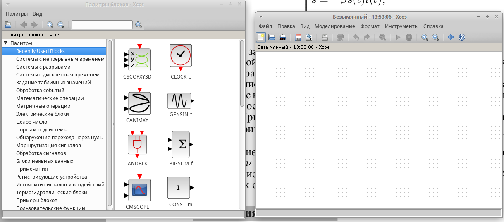{#fig:001 width=40%}

## Задание параметров модели

Заданы значения:

\beta = 1, \quad \nu = 0.3. 

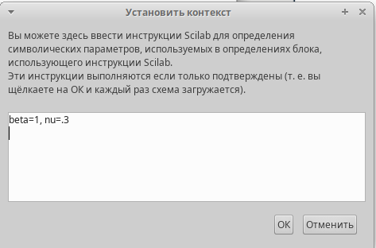{#fig:002 width=40%}

## Построение модели в Xcos

Модель была собрана с использованием следующих блоков: 

- **CLOCK_c** — для управления временем моделирования.

- **INTEGRAL_m** — для интегрирования уравнений.

- **GAINBLK_f** — для задания коэффициентов  и .

- **SUMMATION** — для суммирования потоков.

- **PROD_f** — для вычисления произведений.]

## Построение модели в Xcos

- **MUX** — для объединения данных на один график.

- **CSCOPE** — для визуализации графиков.

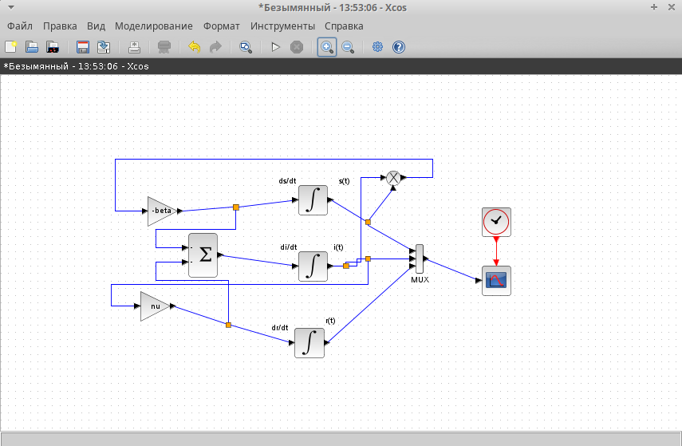{#fig:003 width=40%}

## Построение модели в Xcos

Начальные условия были установлены:
$$
S(0)=0.999
I(0)=0.001
R(0)=0
$$
## Запуск графика модели SIR

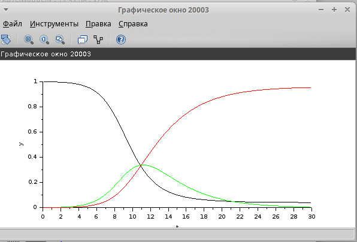{#fig:004 width=40%}

При запуске модели были получены три графика: 

- График S(t) (синим) показывает уменьшение восприимчивых особей.

- График I(t) (зелёным) показывает рост заражённых, достигая максимума.

- График R(t) (красным) показывает увеличение выздоровевших.

## Построение модели в Xcos

Пик числа заражённых i(t) показывает максимальное количество больных в популяции одновременно. Это важный показатель, который может быть использован для оценки нагрузки на систему здравоохранения во время эпидемии.

## Реализация модели в Modelica

- Далее я использовал блок "Modelica generic" в Xcos для реализации модели SIR. Это оказалось проще, так как код на языке Modelica более компактный и читаемый 

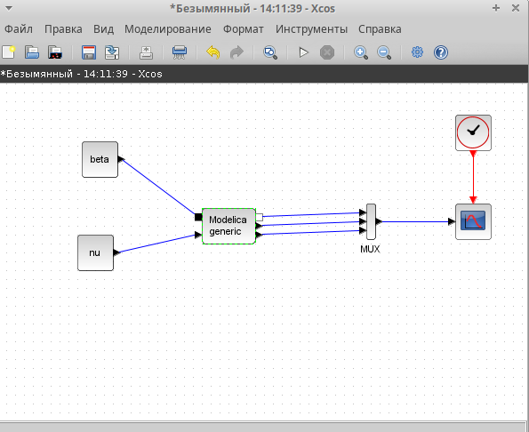{#fig:005 width=40%}

## Реализация модели в Modelica

- здесь я ввел значения констант и выходных переменных, которые мы имеем в модели 

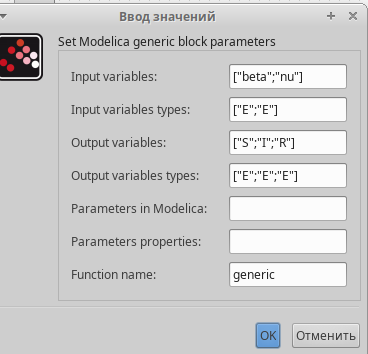{#fig:006 width=40%}

## Реализация модели в Modelica

- Для реализации модели использовался Modelica Generic Block. Код:.

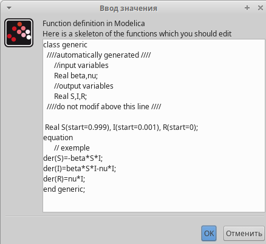{#fig:007 width=40%}

## Реализация модели в Modelica

Я запустил симуляцию с использованием блока Modelica и получил те же графики, что и в шаге 4. Это ожидаемо, так как параметры и уравнения остались неизменными, что подтверждает корректность реализации модели. 

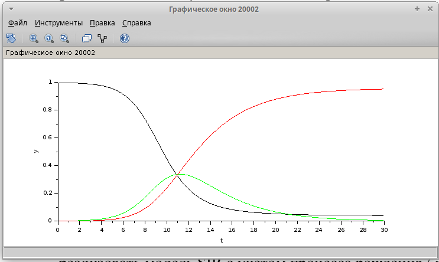{#fig:008 width=40%}

## Решение упражнения с добавлением рождаемости

Для модификации модели было необходимо добавить процессы рождаемости и смертности. Новая система дифференциальных уравнений выглядит следующим образом:

$$
\begin{cases}
\frac{dS}{dt} = - \beta S I + \mu (N - S),\\
\frac{dI}{dt} = \beta S I - \nu I - \mu I,\\
\frac{dR}{dt} = \nu I - \mu R.
\end{cases}
$$

## Решение упражнения с добавлением рождаемости

μ — коэффициент рождаемости и смертности, который учитывает приток новых уязвимых и естественную убыль населения во всех группах.
N — общая популяция, принятая равной 1 (нормированная).

- Эта модификация делает модель более реалистичной, так как в реальной жизни популяция не остаётся полностью замкнутой, а обновляется за счёт рождений и смертей.

## Построение модифицированной модели в Xcos

Я построил новую модель в Xcos, добавив блоки для учёта $\mu$. Уравнения теперь включают дополнительные члены:

- Для \( s(t) \): 
  $$ 
  \frac{ds}{dt} = \dots + \mu (N - s(t)) 
  $$

- Для \( i(t) \): 
  $$ 
  \frac{di}{dt} = \dots - \mu i(t) 
  $$

- Для \( r(t) \): 
  $$ 
  \frac{dr}{dt} = \dots - \mu r(t) 
  $$ 

## Построение модифицированной модели в Xcos 

как показано в 

{#fig:009 width=40%}

## Анализ графиков для модифицированной модели

- Сначала я установил μ=0, чтобы проверить, совпадает ли модифицированная модель с базовой SIR. Графики были идентичны тем, что получены в шагах 4 и 6, что подтвердило правильность построения модели, так как при μ=0 рождаемость и смертность отсутствуют 

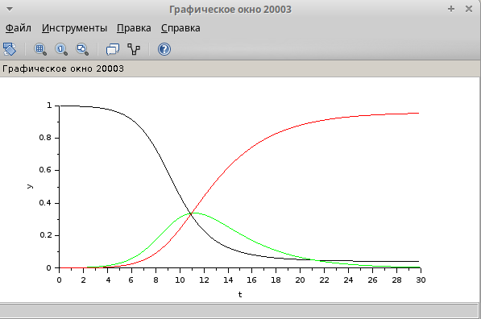{#fig:010 width=40%}

## Анализ графиков для модифицированной модели

затем я изменил μ=0.2 и запустил симуляцию. На графиках видно 

- Число уязвимых s(t) стабилизируется на определённом уровне, а не падает до нуля, из-за притока новых уязвимых за счёт рождаемости.
- Число заражённых i(t) также не исчезает, а остаётся на постоянном уровне, что указывает на эндемическое состояние.

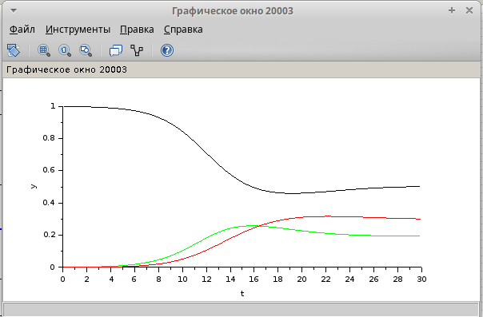{#fig:011 width=35%}

## Построение модифицированной модели с помощью Modelica

- использовали блок "Modelica generic" для реализации модифицированной модели. Код был обновлён следующим образом 

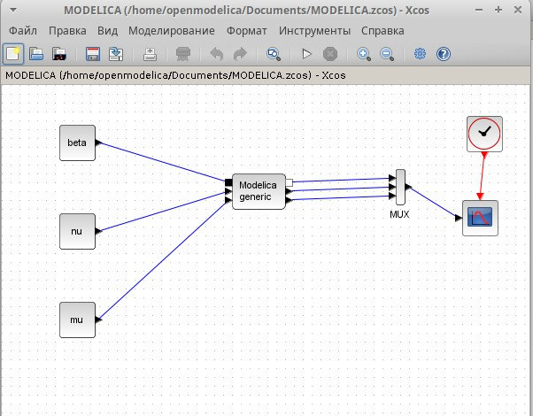{#fig:012 width=40%}

## Построение модифицированной модели с помощью Modelica

- здесь я ввел значения констант и выходных переменных, которые мы имеем в модели 

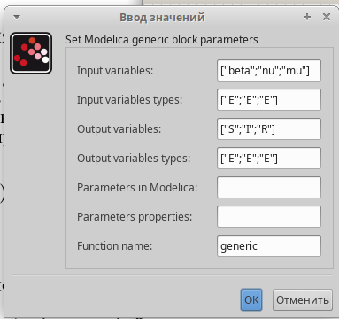{#fig:013 width=40%}

### Код:.

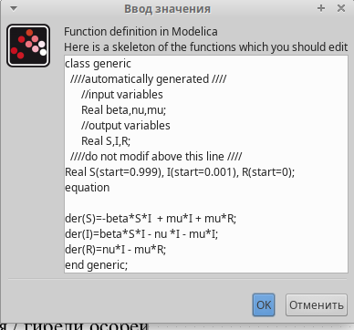{#fig:014 width=40%}

## Визуализация графиков для модифицированной модели

- Я запустил симуляцию и получил графики, аналогичные тем, что были ранее. Это подтвердило, что модель работает корректно в обоих подходах (блоки и Modelica) 

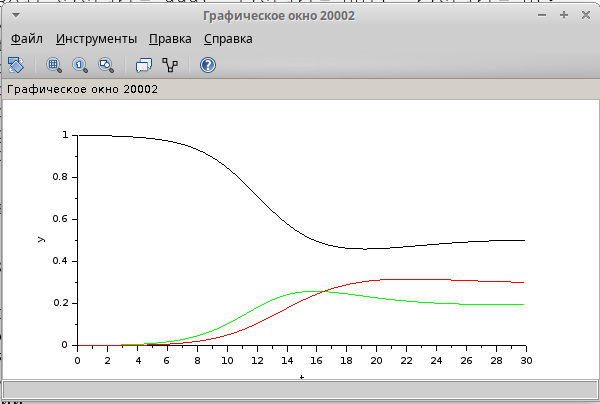{#fig:015 width=40%}

## Моделирование в OpenModelica (OMEdit)

- Я перенёс модифицированную модель в среду OpenModelica (OMEdit) 

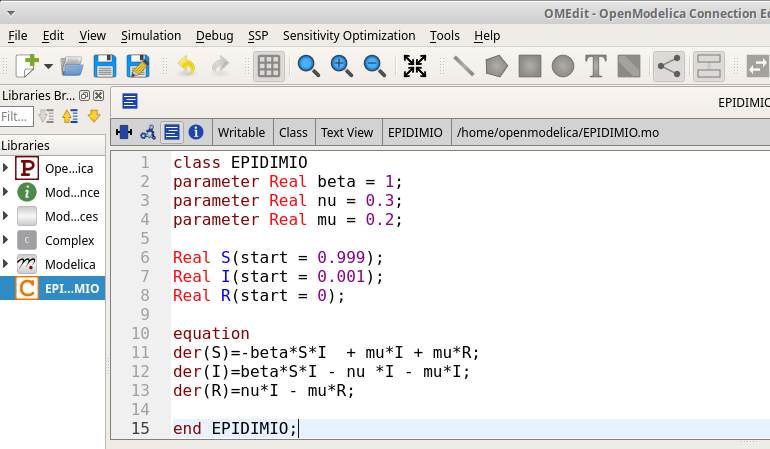{#fig:016 width=40%}

## Моделирование в OpenModelica (OMEdit)

- провёл симуляцию с μ=0.2. Графики были визуализированы и показали ту же динамику, что и в Xcos, что подтверждает согласованность результатов 

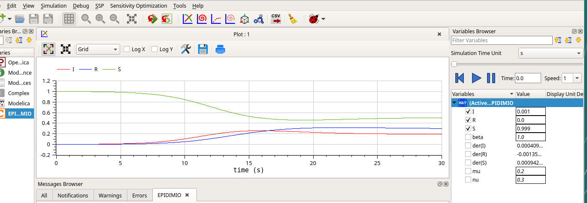{#fig:017 width=40%}

## Исследование различных случаев (β=10,μ=0.7)

- Я провёл эксперимент, установив β=10 и μ=0.7. На графиках видно:

- Число уязвимых s(t) падает практически мгновенно из-за высокого коэффициента заражения.
- Число заражённых i(t) резко возрастает, но благодаря высокому μ=0.7 (быстрая убыль населения) и выздоровлению эпидемия затухает примерно через 5 дней 

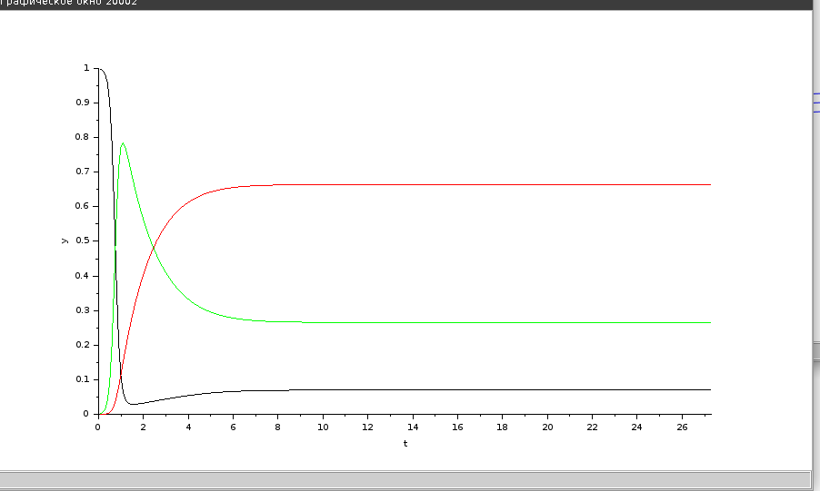{#fig:018 width=40%}

## Исследование случая с ν=0.9

- Я установил nu=0.9, что соответствует очень быстрому выздоровлению. В этом случае эпидемия не развивается:

- Число уязвимых s(t) остаётся близким к начальному значению (0.999) и постепенно приближается к 1.

## Исследование случая с ν=0.9

- Число заражённых i(t) быстро падает до нуля, так как люди моментально выздоравливают.

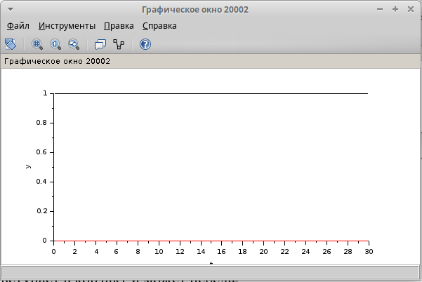{#fig:019 width=40%}

# Выводы

В ходе лабораторной работы была успешно реализована и исследована модель SIR для описания динамики распространения эпидемии. Были выполнены следующие задачи:

- Построена базовая модель SIR в Xcos с использованием блоков и через язык Modelica, а также проведена её симуляция.
- Модифицирована модель с учётом рождаемости и смертности, что позволило наблюдать переход к эндемическому состоянию.
- Исследованы различные случаи с изменением параметров β, ν и μ, что продемонстрировало их влияние на динамику эпидемии.

Полученные результаты показывают, как математические модели могут быть применены для анализа эпидемиологических процессов и подчёркивают важность учёта демографических факторов для долгосрочных прогнозов.

