---
## Front matter
lang: ru-RU
title: Лабораторная работа № 6
subtitle: Модель «хищник–жертва»
author:
  - Мугари Абдеррахим
institute:
  - Российский университет дружбы народов, Москва, Россия
date: 15 марта 2025

## i18n babel
babel-lang: russian
babel-otherlangs: english

## Formatting pdf
toc: false
toc-title: Содержание
slide_level: 2
aspectratio: 169
section-titles: true
theme: metropolis
header-includes:
 - \metroset{progressbar=frametitle,sectionpage=progressbar,numbering=fraction}
---

# Информация

## Преподаватель 

:::::::::::::: {.columns align=center}
::: {.column width="70%"}

  * Анна Владиславовна Королькова
  * доцент кафедры прикладной информатики и теории вероятностей РУДН; 
  * заведующий лабораторией кафедры прикладной информатики и теории вероятностей РУДН (по совместительству); 
  *  программист I кат. 
  * Российский университет дружбы народов
  * [korolkova-av@rudn.ru](mailto:korolkova-av@rudn.ru)

:::
::: {.column width="30%"}


:::
::::::::::::::

## Докладчик

:::::::::::::: {.columns align=center}
::: {.column width="70%"}

  * Мугари Абдеррахим
  * Студент третьего курса 
  * фундаментальная информатика и информационные технологии
  * Российский университет дружбы народов
  * [1032215692@rudn.ru](mailto:1032215692@rudn.ru)
  * <https://iragoum.github.io/>

:::
::: {.column width="30%"}


:::
::::::::::::::


# Цель работы

Основной задачей данной лабораторной работы является освоение и практическое воплощение модели "хищник-жертва" (известной как модель Лотки-Вольтерры) с применением программных средств xcos и OpenModelica.

## Задание

1. Построить модель "хищник-жертва" в среде xcos. 
2. Создать модель "хищник-жертва" с использованием блока Modelica в xcos. 
3. Выполнить моделирование системы "хищник-жертва" в OpenModelica.

# Выполнение лабораторной работы

Модель "хищник-жертва", или модель Лотки-Вольтерры, описывает динамику взаимодействия двух видов — жертв и хищников. Она выражается системой дифференциальных уравнений:

$$
\begin{cases}
  \dot{x} = a x - b x y \\
  \dot{y} = c x y - d y
\end{cases}
$$

где: 
- \(x\) — численность популяции жертв; 
- \(y\) — численность популяции хищников; 
- \(a\) — показатель роста числа жертв; 
- \(b\) — коэффициент сокращения жертв из-за хищников; 
- \(c\) — коэффициент увеличения хищников благодаря жертвам;
- \(d\) — показатель естественного уменьшения хищников.

## Реализация модели в xcos

Для моделирования приняты следующие параметры: \(a = 2\), \(b = 1\), \(c = 0.3\), \(d = 1\), а также начальные значения \(x(0) = 2\), \(y(0) = 1\).

В xcos через меню *Моделирование → Задать переменные окружения* определены значения коэффициентов \(a\), \(b\), \(c\), \(d\)

{#fig:001 width=40%}

## Реализация модели в xcos

Для создания модели применялись блоки: `CLOCK_c`, `CSCOPE`, `TEXT_f`, `MUX`, `INTEGRAL_m`, `GAINBLK_f`, `SUMMATION`, `PROD_f`, а также `CSCOPXY` для построения фазового портрета. Итоговая схема модели представлена.

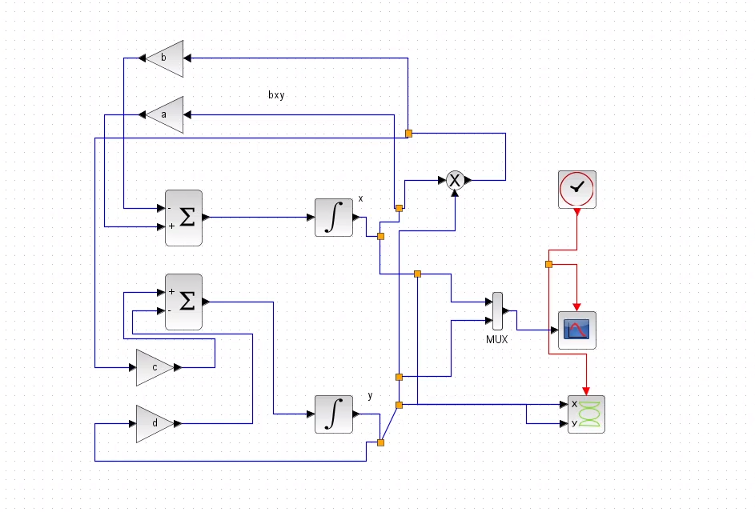{#fig:002 width=40%}


## Реализация модели в xcos

Начальные условия \(x(0) = 2\) и \(y(0) = 1\) установлены в блоках интегрирования .

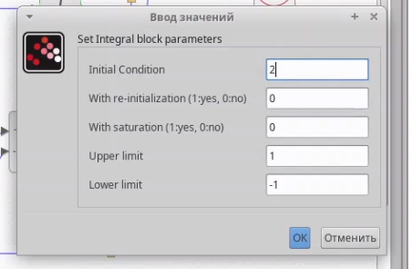{#fig:003 width=40%}

## Реализация модели в xcos

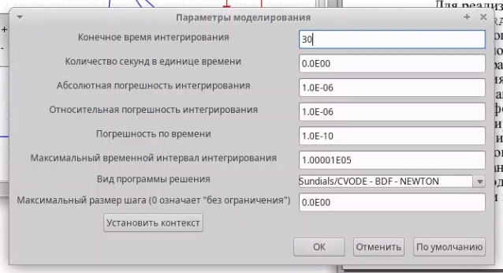{#fig:004 width=40%}

Через меню *Моделирование → Установка* задано время симуляции — 30 секунд.

## Реализация модели в xcos

**Настройка осей графиков**

Для наглядного отображения результатов симуляции настроены оси графиков в блоках `CSCOPE` (временные графики) и `CSCOPXY` (фазовый портрет):

- **Временные графики (`CSCOPE`)**: 
  - Ось Y (численность популяций) настроена в диапазоне от 0 до 10 для отображения колебаний 

## Реализация модели в xcos

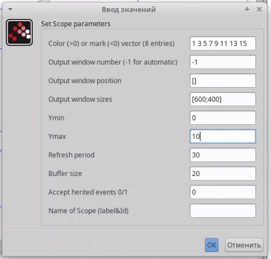{#fig:005 width=50%}


## Реализация модели в xcos

- **Фазовый портрет (`CSCOPXY`)**:
  - Ось X (жертвы, \(x\)): диапазон от 0 до 10, исходя из пиковых значений численности жертв. 
  - Ось Y (хищники, \(y\)): диапазон от 0 до 10, исходя из пиковых значений численности хищников

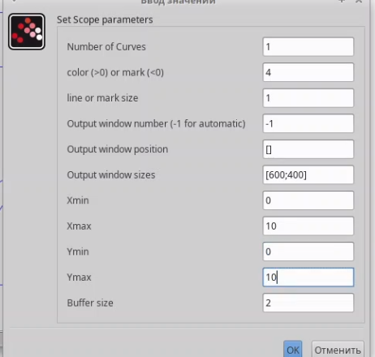{#fig:006 width=40%}


## График изменения численности жертв и хищников

Такая настройка позволила чётко визуализировать поведение системы.

Результаты симуляции представлены  (динамика численности: чёрная линия — \(x(t)\), зелёная — \(y(t)\)) и (фазовый портрет).

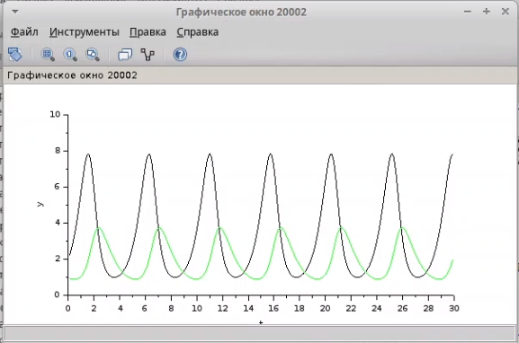{#fig:007 width=40%}


## Реализация модели в xcos

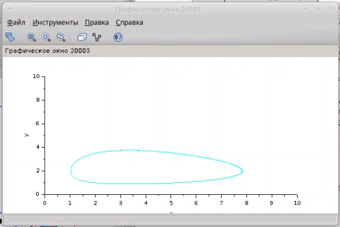{#fig:008 width=70%}


## Реализация модели с помощью блока Modelica в xcos

Альтернативная реализация выполнена с использованием блока `MBLOCK` (Modelica generic) и блоков: `CLOCK_c`, `CSCOPE`, `CSCOPXY`, `TEXT_f`, `MUX`, `CONST_m`. Коэффициенты \(a\), \(b\), \(c\), \(d\) остались прежними 

Схема модели с блоком Modelica показана . Параметры блока, включая входные («a», «b», «c», «d») и выходные («x», «y») переменные, обозначенные как внешние («E»), представлены 

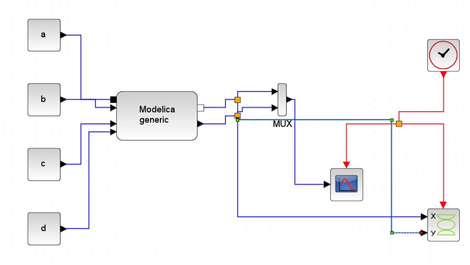{#fig:009 width=40%}

## Настройки блока Modelica (часть 1

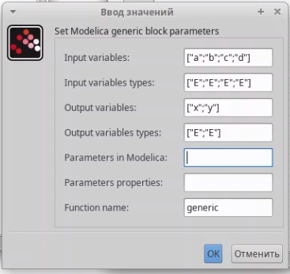{#fig:010 width=50%}

## Настройки блока Modelica (часть 2

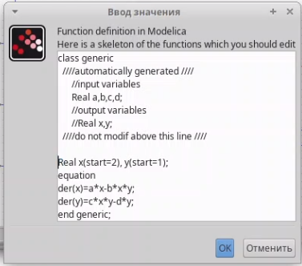{#fig:011 width=50%}

## Динамика численности с блоком Modelica

Результаты симуляции (динамика и фазовый портрет совпадают с предыдущими, подтверждая корректность подхода.

{#fig:012 width=40%}

## Фазовый портрет с блоком Modelica

{#fig:013 width=50%}

## Упражнение: реализация модели в OpenModelica

Модель также реализована в OpenModelica. Код на языке Modelica:

```modelica
model predatorvsprey
  parameter Real a = 2;
  parameter Real b = 1;
  parameter Real c = 0.3;
  parameter Real d = 1;

  Real x(start=2);
  Real y(start=1);
equation
der(x) = a * x - b * x * y;
der(y) = c * x * y - d * y;
end predatorvsprey;

```

## Упражнение: реализация модели в OpenModelica

Cимуляция выполнена с длительностью 30 секунд. Итоги представлены на (динамика численности) и (фазовый портрет).

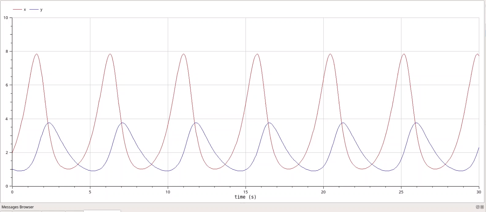{#fig:014 width=70%}

## Фазовый портрет модели Лотки-Вольтерры при (a = 2, b = 1, c = 0.3, d = 1, x(0) = 2, y(0) = 1)

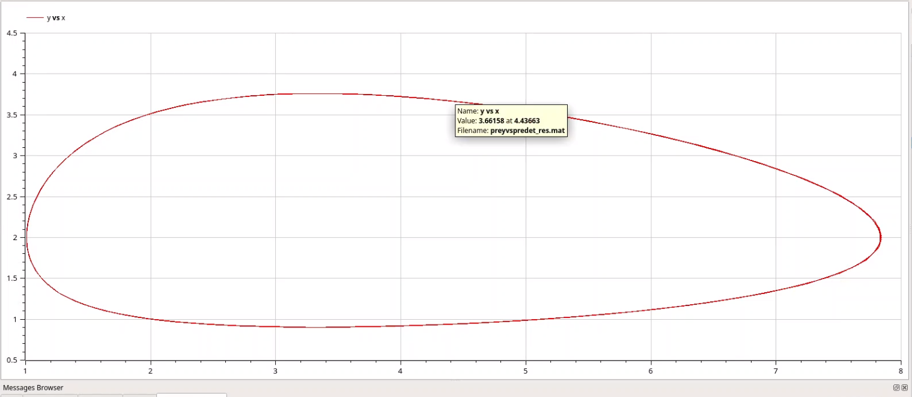{#fig:015 width=70%}

# Выводы

- В процессе выполнения лабораторной работы модель "хищник-жертва" была успешно смоделирована в xcos (с использованием стандартных блоков и блока Modelica) и в OpenModelica. Построенные графики динамики популяций и фазовые портреты отражают поведение системы при заданных условиях.


