---
## Front matter
title: "Лабораторная работа 6"
subtitle: "Модель «хищник–жертва»"
author: "Мугари Абдеррахим"

## Generic options
lang: ru-RU
toc-title: "Содержание"

## Bibliography
bibliography: bib/cite.bib
csl: pandoc/csl/gost-r-7-0-5-2008-numeric.csl

## Pdf output format
toc: true # Table of contents
toc-depth: 2
lof: true # List of figures
lot: true # List of tables
fontsize: 13pt
linestretch: 1.5
papersize: a4
documentclass: scrreprt
## I18n polyglossia
polyglossia-lang:
  name: russian
  options:
    - spelling=modern
    - babelshorthands=true
polyglossia-otherlangs:
  name: english
## I18n babel
babel-lang: russian
babel-otherlangs: english
## Fonts
mainfont: Times New Roman
romanfont: Times New Roman
sansfont: Times New Roman
monofont: "Courier New"
mathfont: STIX Two Math
mainfontoptions: Scale=1.0
romanfontoptions: Scale=1.0
sansfontoptions: Scale=1.0
monofontoptions: Scale=1.0,FakeStretch=0.9
mathfontoptions:
## Biblatex
biblatex: true
biblio-style: "gost-numeric"
biblatexoptions:
  - parentracker=true
  - backend=biber
  - hyperref=auto
  - language=auto
  - autolang=other*
  - citestyle=gost-numeric
## Pandoc-crossref LaTeX customization
figureTitle: "Рис."
tableTitle: "Таблица"
listingTitle: "Листинг"
lofTitle: "Список иллюстраций"
lotTitle: "Список таблиц"
lolTitle: "Листинги"
## Misc options
indent: true
header-includes:
  - \usepackage{listings}
  - \renewcommand{\lstlistingname}{Листинг}
  - \usepackage{indentfirst}
  - \usepackage{float} # keep figures where there are in the text
  - \floatplacement{figure}{H} # keep figures where there are in the text
  - \renewcommand{\familydefault}{\rmdefault} # Ensure Times New Roman for main text
  - \lstset{basicstyle=\ttfamily\fontsize{10pt}{10pt}\selectfont,lineskip=-1pt} 

---

# Цель работы

Основной задачей данной лабораторной работы является освоение и практическое воплощение модели "хищник-жертва" (известной как модель Лотки-Вольтерры) с применением программных средств xcos и OpenModelica.

# Задание

1. Построить модель "хищник-жертва" в среде xcos. 
2. Создать модель "хищник-жертва" с использованием блока Modelica в xcos. 
3. Выполнить моделирование системы "хищник-жертва" в OpenModelica.

# Выполнение лабораторной работы

Модель "хищник-жертва", или модель Лотки-Вольтерры, описывает динамику взаимодействия двух видов — жертв и хищников. Она выражается системой дифференциальных уравнений:

$$
\begin{cases}
  \dot{x} = a x - b x y \\
  \dot{y} = c x y - d y
\end{cases}
$$

где: 
- \(x\) — численность популяции жертв; 
- \(y\) — численность популяции хищников; 
- \(a\) — показатель роста числа жертв; 
- \(b\) — коэффициент сокращения жертв из-за хищников; 
- \(c\) — коэффициент увеличения хищников благодаря жертвам;
- \(d\) — показатель естественного уменьшения хищников.

## Реализация модели в xcos

Для моделирования приняты следующие параметры: \(a = 2\), \(b = 1\), \(c = 0.3\), \(d = 1\), а также начальные значения \(x(0) = 2\), \(y(0) = 1\).

В xcos через меню *Моделирование → Задать переменные окружения* определены значения коэффициентов \(a\), \(b\), \(c\), \(d\) (см. рис. [-@fig:001]).

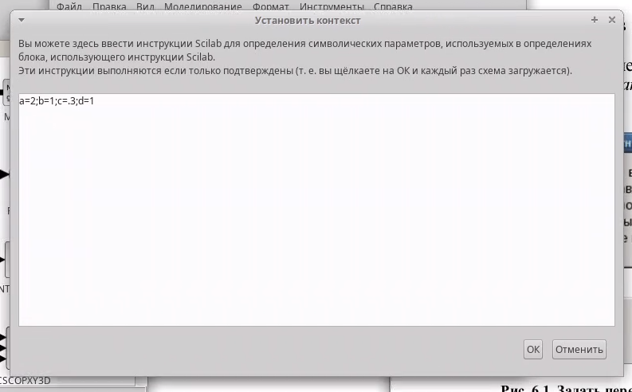{#fig:001 width=70%}

Для создания модели применялись блоки: `CLOCK_c`, `CSCOPE`, `TEXT_f`, `MUX`, `INTEGRAL_m`, `GAINBLK_f`, `SUMMATION`, `PROD_f`, а также `CSCOPXY` для построения фазового портрета. Итоговая схема модели представлена на рис. [-@fig:002].

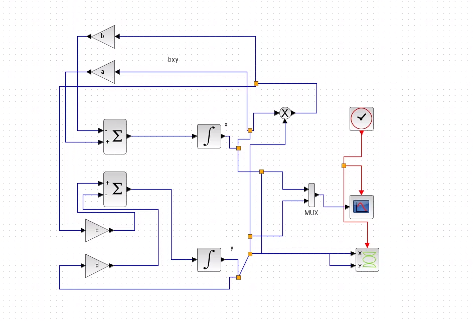{#fig:002 width=70%}

Начальные условия \(x(0) = 2\) и \(y(0) = 1\) установлены в блоках интегрирования (см. рис. [-@fig:003], [-@fig:004]).

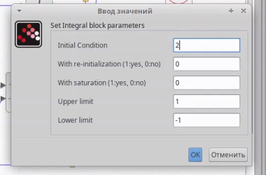{#fig:003 width=70%}

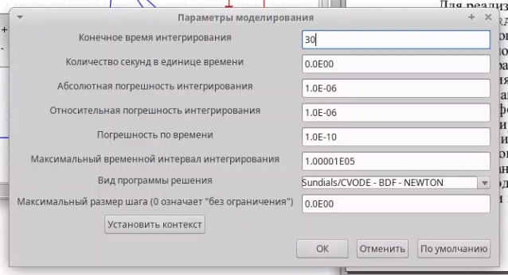{#fig:004 width=70%}

Через меню *Моделирование → Установка* задано время симуляции — 30 секунд.

**Настройка осей графиков**

Для наглядного отображения результатов симуляции настроены оси графиков в блоках `CSCOPE` (временные графики) и `CSCOPXY` (фазовый портрет):

- **Временные графики (`CSCOPE`)**: 
  - Ось Y (численность популяций) настроена в диапазоне от 0 до 10 для отображения колебаний (см. рис. [-@fig:005]). 

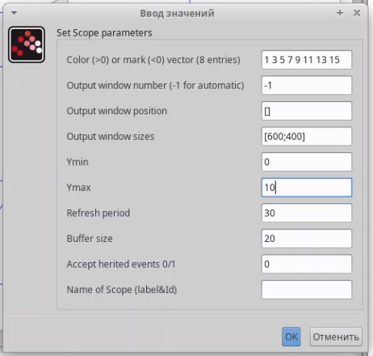{#fig:005 width=70%}

- **Фазовый портрет (`CSCOPXY`)**:
  - Ось X (жертвы, \(x\)): диапазон от 0 до 10, исходя из пиковых значений численности жертв. 
  - Ось Y (хищники, \(y\)): диапазон от 0 до 10, исходя из пиковых значений численности хищников (см. рис. [-@fig:006]). 

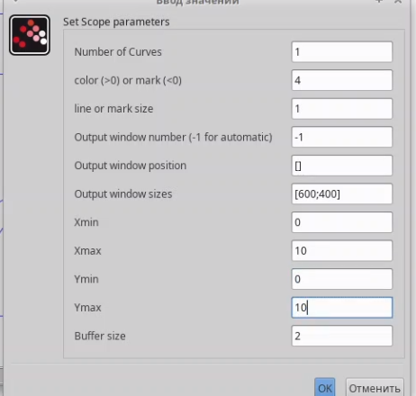{#fig:006 width=70%}

Такая настройка позволила чётко визуализировать поведение системы.

Результаты симуляции представлены на рис. [-@fig:007] (динамика численности: чёрная линия — \(x(t)\), зелёная — \(y(t)\)) и рис. [-@fig:008] (фазовый портрет).

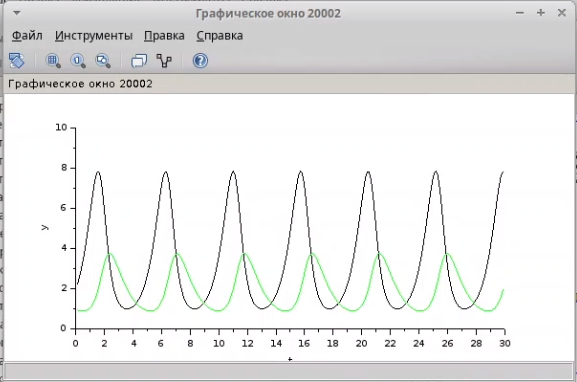{#fig:007 width=70%}

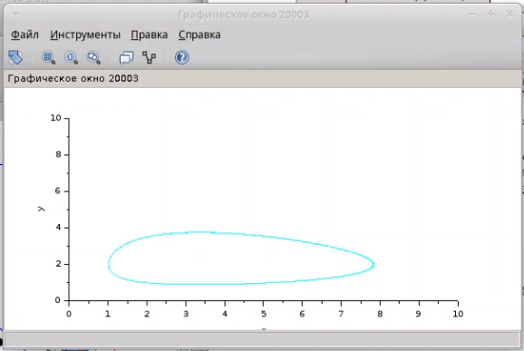{#fig:008 width=70%}

## Реализация модели с помощью блока Modelica в xcos

Альтернативная реализация выполнена с использованием блока `MBLOCK` (Modelica generic) и блоков: `CLOCK_c`, `CSCOPE`, `CSCOPXY`, `TEXT_f`, `MUX`, `CONST_m`. Коэффициенты \(a\), \(b\), \(c\), \(d\) остались прежними (см. рис. [-@fig:001]).

Схема модели с блоком Modelica показана на рис. [-@fig:009]. Параметры блока, включая входные («a», «b», «c», «d») и выходные («x», «y») переменные, обозначенные как внешние («E»), представлены на рис. [-@fig:010] и [-@fig:011].

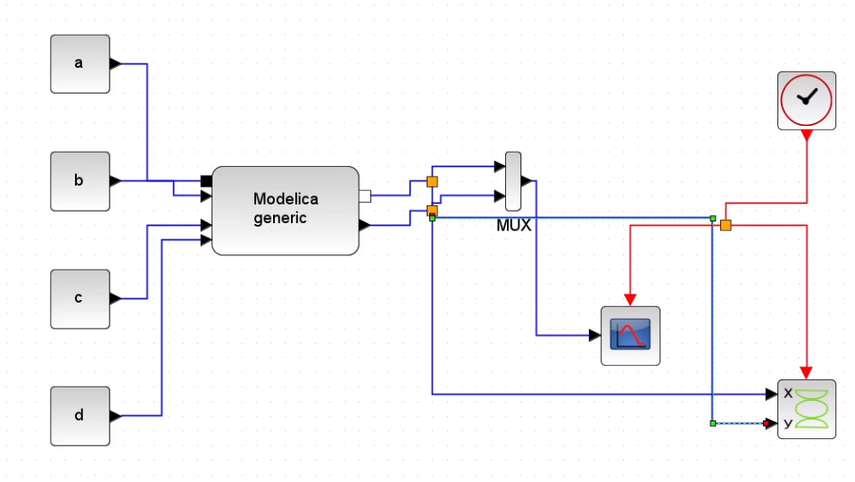{#fig:009 width=70%}

{#fig:010 width=70%}

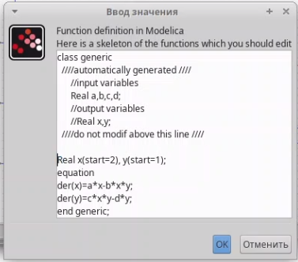{#fig:011 width=70%}

Результаты симуляции (динамика на рис. [-@fig:012] и фазовый портрет на рис. [-@fig:013]) совпадают с предыдущими, подтверждая корректность подхода.

{#fig:012 width=70%}

{#fig:013 width=70%}

## Упражнение: реализация модели в OpenModelica

Модель также реализована в OpenModelica. Код на языке Modelica:

```modelica
model predatorvsprey
  parameter Real a = 2;
  parameter Real b = 1;
  parameter Real c = 0.3;
  parameter Real d = 1;

  Real x(start=2);
  Real y(start=1);
equation
der(x) = a * x - b * x * y;
der(y) = c * x * y - d * y;
end predatorvsprey;

```


имуляция выполнена с длительностью 30 секунд. Итоги представлены на рис. [-@fig:014] (динамика численности) и рис. [-@fig:015] (фазовый портрет).

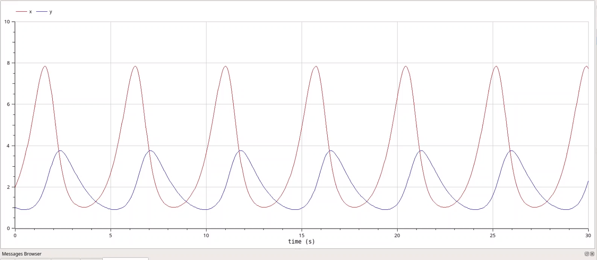{#fig:014 width=70%}

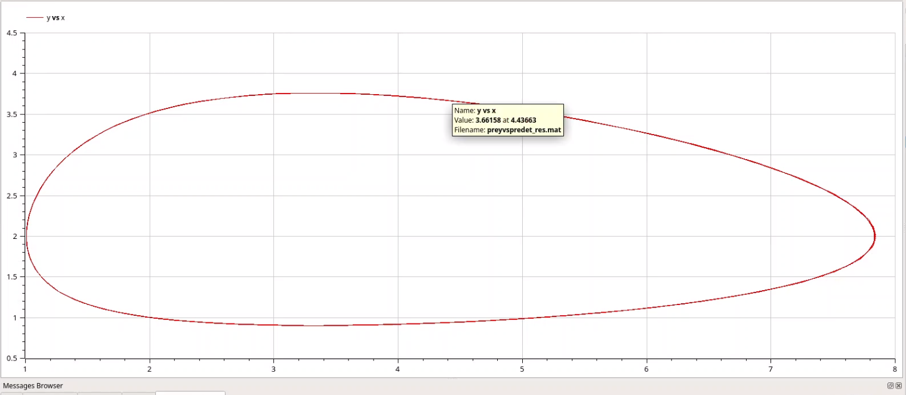{#fig:015 width=70%}

# Выводы

- В процессе выполнения лабораторной работы модель "хищник-жертва" была успешно смоделирована в xcos (с использованием стандартных блоков и блока Modelica) и в OpenModelica. Построенные графики динамики популяций и фазовые портреты отражают поведение системы при заданных условиях.

Подробнее см. в [@strogatz_book_nonlinear-dynamics_en; @hirsch_book_differential-equations_en; @fritzson_book_modelica_en].

# Список литературы{.unnumbered}

::: {#refs}
:::

